# SensorSimulation 当前架构说明

> 本文描述当前代码实际存在的架构，不把路线规划中的功能写成已完成。  
> 各部分统一采用：**为什么要做 → 如何做 → 下一步做什么/如何优化**。

## 1. 总体架构

SensorSimulation 当前分成四个模块：

- `SimulationCore`：公共协议、坐标转换和纯算法。
- `SimulationRenderer`：Camera Channel、Semantic Global Shader 和异步 GPU 图像读回。
- `SimulationRuntime`：时钟、传感器调度、数据校验、帧聚合和导出队列骨架。
- `SimulationEditor`：编辑器扩展入口，目前只有模块骨架。

### 模块依赖流程图

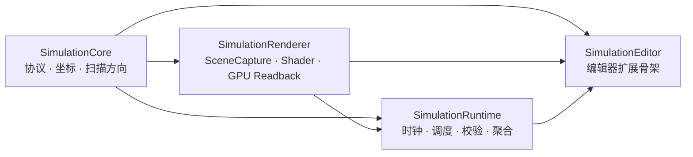

箭头表示“被依赖模块 → 使用它的模块”。Renderer 不依赖 Runtime；Camera 到 Subsystem 的桥接放在 Runtime，避免循环依赖。

### 为什么要这样分层

渲染线程、游戏世界调度和公共协议具有不同生命周期。分层可以避免渲染模块持有 Runtime 对象、协议依赖 UE 渲染细节，以及 Editor API 污染打包运行时。

#### 如何做

- 公共数据结构集中在 `SimulationCore/Public/SimulationTypes.h`。
- Renderer 只生产 `FImagePayload`，不了解 `USimulationSubsystem`。
- Runtime 通过 `USimCameraSensorComponent` 连接 Camera Rig 和 Subsystem。
- Editor 依赖运行时模块，但运行时模块不反向依赖 Editor。

#### 下一步做什么/如何优化

- 为每个模块增加独立自动化测试。
- 继续缩小 Public 模块依赖。
- 在 Editor 模块实现 Demo Map、调试面板和数据质量可视化。

---

## 2. 一帧数据的总体流程

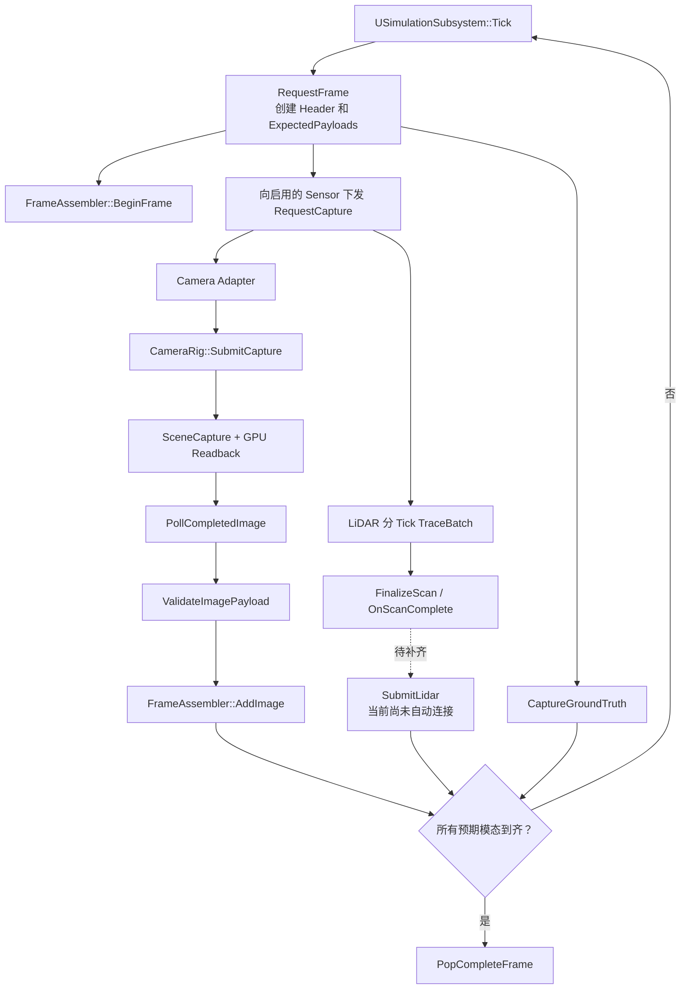

### 为什么要统一 Frame Header

RGB、Semantic 和 LiDAR 的完成时间不同。GPU 图像可能晚一到数帧返回，LiDAR 也可能跨多个 Tick。所有异步结果必须保存最初的 FrameId 和时间戳，才能正确聚合。

#### 如何做

- `RequestFrame` 创建唯一 `FFrameHeader`。
- 所有传感器收到相同的 `SequenceId`、`FrameId` 和时间戳。
- 每个 Payload 保存原始 Header。
- `FFrameAssembler` 使用 FrameId 索引待完成帧。

#### 关键函数定位

| 函数 | 代码位置 | 作用 |
|---|---|---|
| `USimulationSubsystem::Tick` | `Source/SimulationRuntime/Private/SimulationSubsystem.cpp:24` | 推进时钟、请求帧、消费完整帧 |
| `RequestFrame` | `.../SimulationSubsystem.cpp:97` | 创建 Header、计算预期模态、下发请求 |
| `FFrameAssembler::BeginFrame` | `Source/SimulationRuntime/Private/FrameAssembler.cpp:4` | 创建待聚合帧 |
| `PopCompleteFrame` | `.../FrameAssembler.cpp:56` | 移出完整帧 |

#### 下一步做什么/如何优化

- 实现真正的 Deterministic Dataset Clock。
- 增加 Frame Timeout，避免失败帧永久等待。
- 将完成条件从模态位掩码升级为“SensorName + PayloadType + 数量”。

---

## 3. SimulationCore：协议和纯算法

#### 为什么要做

所有模块必须共享唯一数据协议和坐标约定，否则 Camera、LiDAR、Ground Truth 和 Writer 会产生不同单位、轴向或帧编号解释。

#### 如何做

`SimulationTypes.h` 定义：

- `EPayloadType`：RGB、Semantic、Depth、Instance、LiDAR、GroundTruth。
- `FFrameHeader`：序列号、帧号、时间戳和自车位姿。
- `FCaptureRequest`：传感器采集请求。
- `FImagePayload`：CPU 图像。
- `FLidarScanPayload`：点云和扫描进度。
- `FObjectGroundTruth`：对象真值。
- `FFramePacket`：最终聚合帧。

`FCoordinateConverter` 集中处理 Unreal 厘米、Front/Left/Up 米和 OpenCV Camera 坐标转换。  
`FLidarScanPattern` 生成稳定顺序的 LiDAR 局部射线。

#### 数据关系

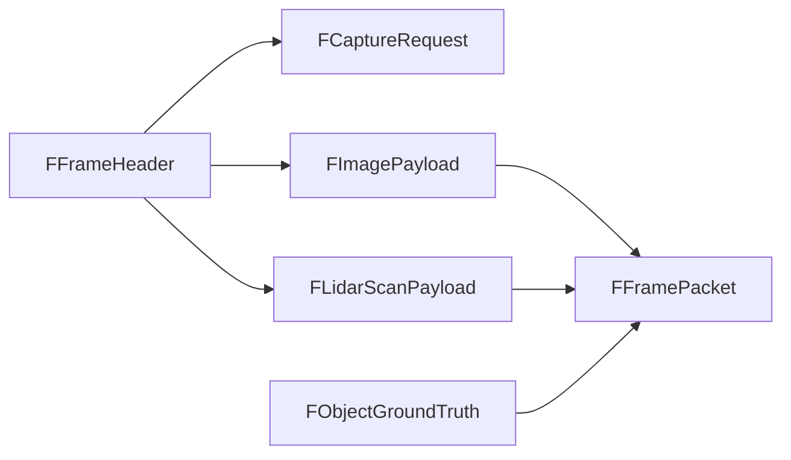

#### 关键函数定位

| 函数/类型 | 代码位置 | 作用 |
|---|---|---|
| `FFramePacket::IsComplete` | `Source/SimulationCore/Public/SimulationTypes.h` | 判断预期模态是否到齐 |
| `FCoordinateConverter::*` | `Source/SimulationCore/Private/CoordinateConverter.cpp` | 集中坐标与单位转换 |
| `FLidarScanPattern::BuildDirections` | `Source/SimulationCore/Private/LidarScanPattern.cpp:10` | 生成 LiDAR 射线方向 |

#### 下一步做什么/如何优化

- 在图像 Payload 中增加 PixelFormat、ColorSpace、ViewRect 和 RowStride。
- 为协议增加版本号。
- 扩充坐标、旋转和投影自动化测试。
---

## 4. SimulationRenderer：相机与 Semantic 渲染

### 4.1 Camera Rig

#### 为什么要做

同一相机位姿需要输出 RGB、Semantic，未来还需要 Depth 和 Instance。不同通道具有不同 Render Target、Gamma 和后处理要求，因此由一个 Camera Rig 统一管理。

#### 如何做

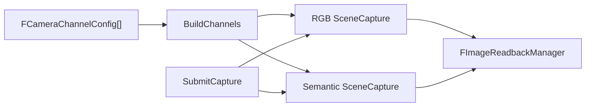

- `BuildChannels` 为每个启用通道创建 Scene Capture 和 Render Target。
- `ConfigureCapture` 设置 Capture Source、Gamma 和 ShowFlags。
- `SubmitCapture` 只捕获请求中需要的 RGB/Semantic。
- 先调用 `CaptureScene()`，再提交 Readback，保证渲染命令顺序正确。

#### 关键函数定位

| 函数 | 代码位置 | 作用 |
|---|---|---|
| `BuildChannels` | `Source/SimulationRenderer/Private/CameraRigComponent.cpp:46` | 创建 Capture 与 Render Target |
| `ConfigureCapture` | `.../CameraRigComponent.cpp:96` | 配置各通道渲染行为 |
| `SubmitCapture` | `.../CameraRigComponent.cpp:138` | 捕获并提交 GPU Readback |
| `PollCompletedImage` | `.../CameraRigComponent.cpp:175` | 非阻塞取出完成图像 |
| `BuildCalibration` | `.../CameraRigComponent.cpp:277` | 计算相机内外参 |
| `SaveSemanticDebugImage` | `.../CameraRigComponent.cpp:236` | 同步调试 PNG，不属于正式管线 |

#### 下一步做什么/如何优化

- 复用 Capture、Render Target 和 Readback 资源。
- 增加通道配置热更新。
- 为 Depth 和 Instance 实现专用格式与读回转换器。

### 4.2 Semantic 无后处理污染流程

#### 为什么要做

Semantic ID 是离散整数。Tonemap、Gamma、TAA、FXAA、Bloom 和双线性采样都会改变标签值，产生不存在的类别或污染边缘。

#### 如何做

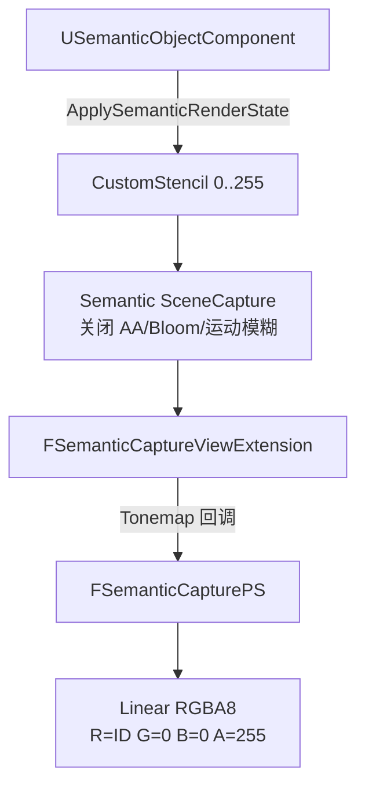

1. Semantic Component 给 Primitive 启用 CustomDepth 并写 CustomStencil。
2. Renderer Module 注册 Shader 虚拟路径和 View Extension。
3. View Extension 识别 Semantic Capture。
4. Global Shader 使用整数像素位置读取 CustomStencil。
5. 输出固定 RGBA 标签，不采样 SceneColor。

#### 关键函数定位

| 函数 | 代码位置 | 作用 |
|---|---|---|
| `ApplySemanticRenderState` | `Source/SimulationRuntime/Private/SemanticObjectComponent.cpp:66` | 写入 CustomStencil |
| `FSimulationRendererModule::StartupModule` | `Source/SimulationRenderer/Private/SimulationRenderer.cpp:30` | 注册 Shader 与 View Extension |
| `SubscribeToPostProcessingPass` | `.../SemanticCaptureViewExtension.cpp:43` | 过滤 Semantic View |
| `RenderSemanticLabels` | `.../SemanticCaptureViewExtension.cpp:60` | 添加 RDG 全屏 Pass |
| `MainPS` | `Shaders/Private/SemanticCapture.usf` | CustomStencil 转 RGBA 标签 |

#### 下一步做什么/如何优化

- 用显式 View 标识替代 Capture Source 约定。
- 实现 32 位 Instance ID 整数 Pass。
- 增加 Nanite、半透明、植被和多 Primitive Actor 测试。

### 4.3 异步 GPU Readback

#### 为什么要做

同步 `ReadPixels()` 会让游戏线程等待 GPU，导致卡顿并破坏固定时钟采集。

#### 如何做

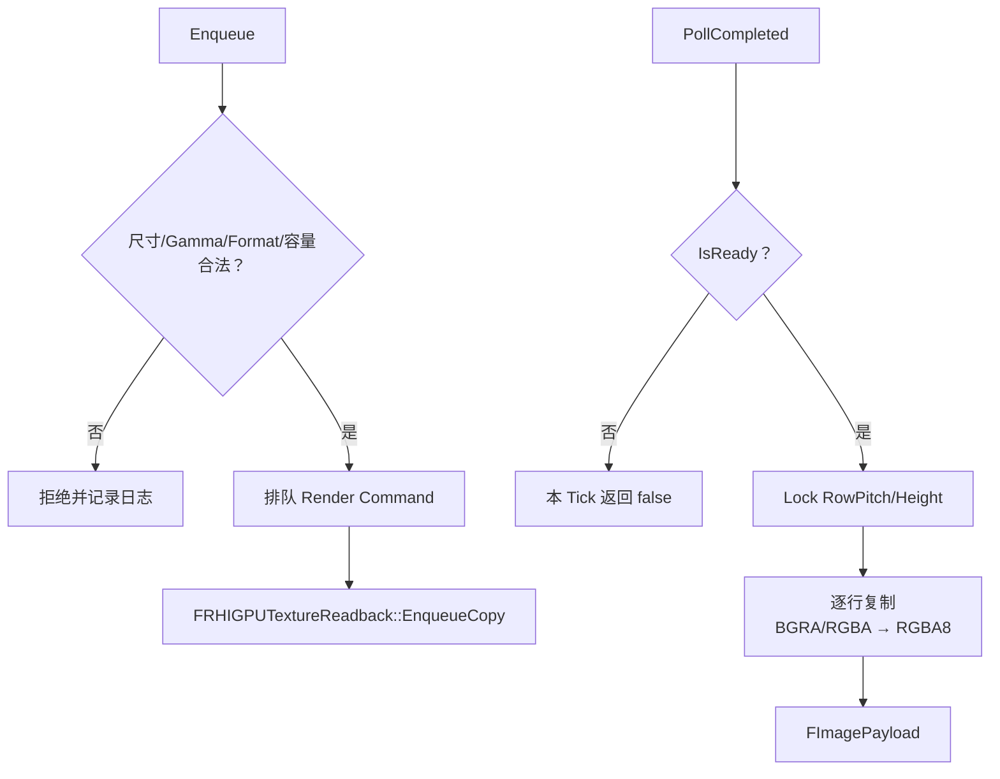

线程边界：

- 游戏线程验证 UObject 属性、预留容量和获取完成 Payload。
- 渲染线程提交 Copy、检查 Fence、Lock/Unlock。
- CPU Payload 拥有独立字节数组，不引用 staging texture。

#### 关键函数定位

| 函数 | 代码位置 | 作用 |
|---|---|---|
| `FImageReadbackManager::Enqueue` | `Source/SimulationRenderer/Private/ImageReadbackManager.cpp:145` | 验证并提交 GPU Copy |
| `PumpReadbacks_RenderThread` | `.../ImageReadbackManager.cpp:65` | 检查 Fence 并复制数据 |
| `CopyToCanonicalRgba` | `.../ImageReadbackManager.cpp:39` | 处理 RowPitch 和 BGRA/RGBA |
| `PollCompleted` | `.../ImageReadbackManager.cpp:211` | 非阻塞获取 Payload |

#### 下一步做什么/如何优化

- 使用统一的渲染线程 Pump，避免每次 Poll 都排队命令。
- 建立 Readback 对象池。
- 将大块像素转换移到 Worker Thread。
- 增加 GPU 延迟、队列深度和拒绝次数统计。
---

## 5. SimulationRuntime：调度、适配、校验和聚合

### 5.1 传感器基类

#### 为什么要做

Camera 与 LiDAR 的采集方式不同，但 Subsystem 需要统一下发请求并了解各传感器能够产生的模态。

#### 如何做

- `USimSensorComponentBase::BeginPlay/EndPlay` 自动注册和注销。
- `GetPayloadTypes` 报告传感器能力。
- `RequestCapture` 是统一采集入口。

#### 关键函数定位

| 函数 | 代码位置 | 作用 |
|---|---|---|
| `USimSensorComponentBase::BeginPlay` | `Source/SimulationRuntime/Private/SimSensorComponentBase.cpp:12` | 注册传感器 |
| `RegisterSensor` | `.../SimulationSubsystem.cpp:53` | 保存传感器弱引用 |
| `GetPayloadTypes` | `Source/SimulationRuntime/Public/SimSensorComponentBase.h` | 报告预期模态 |

#### 下一步做什么/如何优化

- 按各自 `UpdateFrequencyHz` 独立调度。
- 让 `RequestCapture` 返回 Accepted/Busy/Rejected。
- 增加稳定 Sensor GUID。

### 5.2 Camera Runtime Adapter

#### 为什么要做

Renderer 不能依赖 Runtime，因此在 Runtime 中使用 Adapter 调用 Camera Rig，并把完成图像交给 Subsystem。

#### 如何做

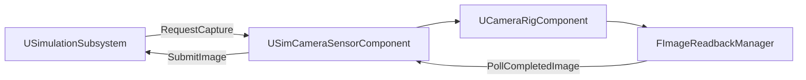

- BeginPlay 自动查找同一 Actor 上的 Camera Rig。
- RequestCapture 转发 Header 并补充相机外参。
- TickComponent 清空完成队列。
- Payload 使用移动语义提交给 Subsystem。

#### 关键函数定位

| 函数 | 代码位置 | 作用 |
|---|---|---|
| `BeginPlay` | `Source/SimulationRuntime/Private/SimCameraSensorComponent.cpp:17` | 查找 Camera Rig |
| `TickComponent` | `.../SimCameraSensorComponent.cpp:31` | 提交完成图像 |
| `GetPayloadTypes` | `.../SimCameraSensorComponent.cpp:57` | 返回 RGB/Semantic 能力 |
| `RequestCapture` | `.../SimCameraSensorComponent.cpp:63` | 转发同步请求 |

#### 下一步做什么/如何优化

- Camera Rig 缺失时输出明确错误并禁用 Adapter。
- 读回拒绝应反馈给 Subsystem。
- 使用集中完成队列或通知机制替代每个 Adapter Tick。

### 5.3 Semantic Registry 与 Payload 校验

#### 为什么要做

正确的 Shader 仍可能被错误 Gamma、RHI 通道顺序、尺寸或非法标签破坏，因此在进入 FrameAssembler 前必须验证。

#### 如何做

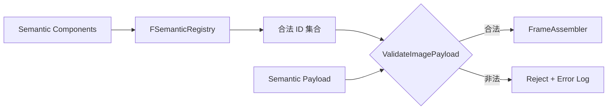

校验内容：

- Readback 前检查尺寸、完整 View Rect、Semantic Linear Gamma 和像素格式。
- CPU Payload 必须为紧密 RGBA8。
- `Bytes.Num() == Width * Height * 4`。
- Semantic 的 R 必须属于 Registry 集合。
- Semantic 的 `G=0、B=0、A=255`。

#### 关键函数定位

| 函数 | 代码位置 | 作用 |
|---|---|---|
| `FSemanticRegistry::Register` | `Source/SimulationRuntime/Private/SemanticRegistry.cpp:6` | 登记对象并分配 InstanceId |
| `GetImageSemanticIds` | `.../SemanticRegistry.cpp:28` | 收集合法 8 位标签 |
| `ValidateImagePayload` | `.../SimulationSubsystem.cpp:133` | 结构和逐像素验证 |
| `SubmitImage` | `.../SimulationSubsystem.cpp:77` | 验证后提交聚合器 |

#### 下一步做什么/如何优化

- 将全像素扫描移到 SIMD、TaskGraph 或 GPU Reduction。
- 日志记录第一个非法像素坐标和 RGBA。
- Registry 主动清理失效弱引用。

### 5.4 LiDAR

#### 为什么要做

一次执行大量同步 Trace 会阻塞单帧，因此当前把完整扫描拆分到多个 Tick。

#### 如何做

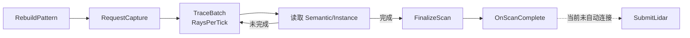

#### 关键函数定位

| 函数 | 代码位置 | 作用 |
|---|---|---|
| `RebuildPattern` | `Source/SimulationRuntime/Private/SimLidarSensorComponent.cpp:22` | 预计算射线 |
| `RequestCapture` | `.../SimLidarSensorComponent.cpp:33` | 初始化扫描 |
| `TraceBatch` | `.../SimLidarSensorComponent.cpp:65` | 分批 Trace |
| `FinalizeScan` | `.../SimLidarSensorComponent.cpp:120` | 完成并广播 |
| `SubmitLidar` | `.../SimulationSubsystem.cpp:91` | 聚合入口，目前未自动连接 |

#### 下一步做什么/如何优化

1. 优先补齐 `OnScanComplete → SubmitLidar`。
2. 使用 UE Async Trace。
3. 使用组件世界变换，支持同一 Actor 上多个 LiDAR。
4. 增加运动畸变、噪声、漏检和多回波模型。

### 5.5 FrameAssembler

#### 为什么要做

不同模态异步完成，只有全部预期数据到齐后才能发布同步帧。

#### 如何做

- BeginFrame 创建待完成 Packet。
- AddImage、AddLidar、AddGroundTruth 写入数据并更新完成位。
- PopCompleteFrame 使用移动语义取出完整帧。

#### 下一步做什么/如何优化

- 防止同一 FrameId 重复进入完成队列。
- 按传感器和模态记录预期数量。
- 增加 Timeout、取消、Pending 上限和迟到 Payload 策略。

### 5.6 ExportService 当前边界

#### 为什么要做

PNG 编码和磁盘 IO 不应阻塞游戏线程，因此需要有界后台队列。

#### 当前如何做

目前只有 Start、Stop、Enqueue、有界 MPSC Queue 和 PendingCount。尚未实现：

- 消费线程和 Dequeue。
- PendingCount 递减。
- PNG/BIN/CSV/JSON Writer。
- 三种背压策略的实际行为。
- Subsystem 完整帧到 ExportService 的连接。

#### 下一步做什么/如何优化

1. 建立可停止的后台 Worker。
2. 定义稳定目录和文件协议。
3. 实现三种背压策略。
4. 使用临时文件加原子 Rename。
5. 写入 Manifest、标定、协议版本和校验值。
---

## 6. 关键对象关系图

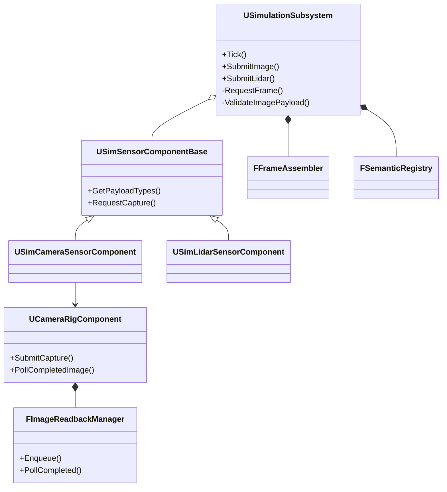

## 7. 线程和所有权

| 对象/数据 | 线程 | 当前所有权 |
|---|---|---|
| `USimulationSubsystem` | 游戏线程 | World Subsystem |
| Sensor Components | 游戏线程 | Actor/Component |
| Scene Capture 配置 | 游戏线程 | Camera Rig |
| Global Shader / RDG Pass | 渲染线程 | View Extension |
| `FRHIGPUTextureReadback` | 渲染线程 | PendingReadbacks |
| Completed 图像队列 | 渲染线程生产、游戏线程消费 | MPSC |
| `FImagePayload::Bytes` | 创建后移交游戏线程 | 独立 CPU 内存 |
| `FFrameAssembler` | 游戏线程 | Subsystem 成员 |
| Export Pending Queue | 计划为游戏线程生产、Worker 消费 | Worker 尚未实现 |

#### 下一步做什么/如何优化

- 用断言明确函数线程要求。
- 将大块像素转换移出渲染线程。
- 增加停止 PIE、模块卸载时的队列取消和排空测试。
- 避免异步任务长期持有没有生命周期保护的 UObject 指针。

---

## 8. 当前完成度

### 已经打通

- Semantic Component → CustomStencil。
- Semantic Global Shader → 无后处理标签图。
- RGB/Semantic → 异步 GPU Readback。
- Camera Adapter → Subsystem。
- 图像合法性校验 → FrameAssembler。
- Ground Truth → FrameAssembler。
- LiDAR 分批扫描和 Payload 生成。

### 尚未闭环

- LiDAR 完成事件 → Subsystem。
- FramePacket → ExportService。
- Export Worker → 文件 Writer。
- 确定性数据集时钟。
- 多个同模态传感器完成数量追踪。
- Frame Timeout 和迟到数据策略。

### 推荐实施顺序

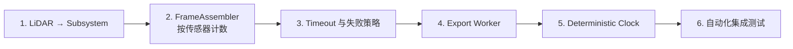

1. 先补齐 LiDAR 提交，否则包含 LiDAR 的帧无法完成。
2. 再强化 FrameAssembler，避免多相机环境过早完成。
3. 加入 Timeout 和失败反馈。
4. 实现 Export Worker 和 Writer。
5. 让确定性时钟与背压联动。
6. 用 Demo Map 固化 RGB、Semantic、LiDAR、Ground Truth 同帧验收。

---

## 9. 最小运行时装配

Camera Actor：

- `UCameraRigComponent`
- `USimCameraSensorComponent`

Semantic Actor：

- 可渲染的 `UPrimitiveComponent`
- `USemanticObjectComponent`
- `bRenderToSemanticCapture=true`
- `SemanticId` 位于 `0..255`

项目设置：

- `r.CustomDepth=3`
- 修改 Renderer Settings 后重启编辑器

正式数据流使用异步 `FRHIGPUTextureReadback`。  
`SaveSemanticDebugImage` 的同步 PNG 只用于人工调试，不能放进逐帧采集路径。
