# SensorSimulation 当前架构说明

> 本文描述当前代码实际存在的架构，不把路线规划中的功能写成已完成。
> 各部分统一采用：**为什么要这样做 → 当前如何做 → 相较旧架构修改了什么及原因 → 下一步做什么/如何优化**。
> 当前状态基于 2026-08-15 的项目源码、编译结果与自动化验收结果。

## 0. 当前状态摘要

当前已经闭环：

- RGB、Semantic、Depth Scene Capture。
- RGB、Semantic、Depth、Instance 异步 GPU 读回。
- Semantic 无颜色后处理污染的 Global Shader。
- Camera Adapter → Runtime Subsystem → FrameAssembler。
- LiDAR 分批扫描 → Runtime Subsystem → FrameAssembler。
- Ground Truth → FrameAssembler。
- 按传感器记录预期/完成模态和帧超时清理。
- 完整帧 → 有界 Export Queue → 后台 Worker → 数据集文件。
- Dataset Session、逐通道相机标定、会话元数据和 Renderer 按通道指标快照。
- Camera Rig/Readback 与 Export Worker 生命周期自动化测试。
- 真正的 32 位 Instance 网格绘制通道、原生 PF_R32_UINT 目标与读回、协议校验和文件写出。
- R15 特殊对象闭环：HISM 逐内部实例、Masked 孔洞、SkeletalMesh、Translucent 的 Ignore/OpaqueProxy 双策略和 D3D12 Nanite 专用路径。
- Renderer 输出矩阵阶段 2：D3D11/D3D12 × 四模态 × 640×480/1280×720，覆盖 Actor 运动、相机前移/复位、遮挡、无残影、OpaqueProxy/Ignore 和 Readback 指标。
- Renderer 输出矩阵阶段 3：前、后、左、右四 Rig 同一 FrameId 并发，覆盖相机与 Actor 联合连续运动、四模态全图对齐、Busy、ChannelGuid 路由和全局 Pump。
- Renderer 输出矩阵阶段 4：四 Rig 中 Rear 在四模态 Readback 仍 Pending 时销毁，其他三台继续交付；Rear 按原 SensorGuid/ChannelGuid 重建后重新加入全局 Pump。
- Renderer 输出矩阵阶段 5：Rear 带四个 Pending Readback 禁用 Semantic，继续提交三模态帧，排空后按原 ChannelGuid 恢复；未受影响通道保持资源复用。

当前仍未闭环：

- D3D11/D3D12 × RGB/Semantic/Depth/Instance 的标准/高清、Actor 运动、相机前移/复位、遮挡和代理策略矩阵已完成；阶段 3 又完成四方向 Rig 并发和相机组/Actor 联合平移，独立相机旋转与抖动尚未纳入。
- 四方向并发、单 Rig Pending 销毁/重建及通道级禁用/恢复已完成；多 Rig 同时退出、Pending 关卡切换、模块卸载和 RHI 设备重建压力测试仍未完成。

---

## 1. 总体架构

SensorSimulation 分成四个模块：

- `SimulationCore`：公共协议、坐标转换和纯算法。
- `SimulationRenderer`：Camera Channel、Scene Capture、Semantic Global Shader 和异步 GPU Readback。
- `SimulationRuntime`：时钟、传感器调度、语义注册、数据校验、帧聚合、数据集会话和后台导出。
- `SimulationEditor`：编辑器扩展入口，目前仍以模块骨架为主；验收场景主要通过关卡资产和 `Tools` 脚本维护。

### 模块依赖

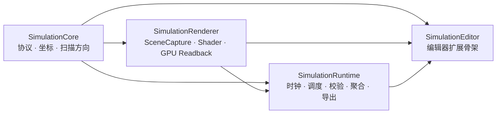

箭头表示“被依赖模块 → 使用它的模块”。`SimulationRenderer` 不依赖 `SimulationRuntime`；Camera 到 Subsystem 的桥接仍放在 Runtime，避免形成循环依赖。

### 为什么要这样分层

渲染线程、游戏世界调度和公共数据协议具有不同生命周期：

- Shader、RDG、RHI Readback 只能由 Renderer 理解。
- World、Actor、Sensor 调度和导出会话属于 Runtime。
- 图像、点云和帧头必须使用不依赖具体渲染后端的公共协议。
- Editor API 不应进入打包运行时模块。

### 当前如何做

- 公共数据结构集中在 `SimulationCore/Public/SimulationTypes.h`。
- Renderer 只生产 `FImagePayload`，不了解 `USimulationSubsystem`。
- Runtime 通过 `USimCameraSensorComponent` 连接 Camera Rig 和 Subsystem。
- Runtime 通过 `USimLidarSensorComponent` 直接把完成扫描提交给 Subsystem。
- Subsystem 把完整 `FFramePacket` 交给 `FExportService`，文件编码与 IO 不进入 Renderer。

### 相较旧架构修改了什么及原因

- **Runtime 从“只有导出队列骨架”升级为完整 Worker。**
  原因是 PNG 编码、BIN/JSON 写入不能阻塞主采集路径；完整帧现在由后台线程消费。
- **帧聚合从纯模态位掩码增加到按传感器状态跟踪。**
  原因是两台相机都输出 RGB 时，第一台 RGB 到达不能代表整帧 RGB 已全部到齐。
- **Renderer 的图像协议增加显式格式和单位。**
  原因是 Depth 与 Semantic 都不能由消费者根据通道名称猜测字节含义。

### 下一步做什么/如何优化

- 继续缩小 Public 头文件的 UE 渲染依赖。
- [x] 运行模式统一使用 Core 的 `ESimulationMode`；Runtime 设置直接引用该反射枚举，配置值保持兼容。
- 在 Editor 模块实现验收场景生成、结果浏览和数据质量面板，逐步替代分散的外部脚本。

---

## 2. 一帧数据的总体流程

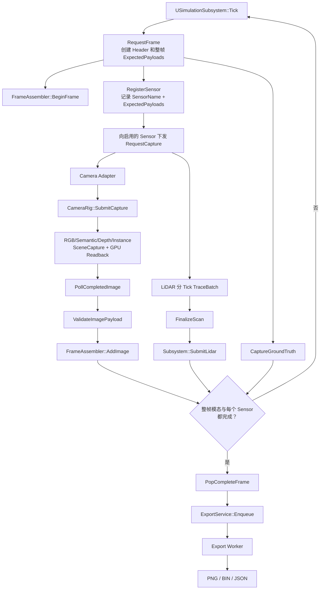

### 为什么要统一 Frame Header

RGB、Semantic、Depth 和 LiDAR 的完成时刻不同：

- Scene Capture 与 GPU Readback 可能晚一到数帧返回。
- LiDAR 会把完整扫描拆成多个 Tick。
- Export Worker 又在独立线程异步写盘。

如果结果不保留最初的 FrameId、时间戳和 SensorGuid，就无法知道不同异步结果是否属于同一同步帧；SensorName 只负责提供可读显示。

### 当前如何做

- `RequestFrame` 创建唯一 `FFrameHeader`。
- 所有传感器收到相同的 `SequenceId`、`FrameId` 和仿真时间戳。
- 每个 Payload 保存原始 Header、稳定 SensorGuid 和显示用 SensorName。
- `FFrameAssembler` 使用 FrameId 索引待完成帧。
- `RegisterSensor` 以 SensorGuid 区分传感器，并以 ChannelGuid 分别保存图像预期；同名传感器或同模态多通道都必须逐项完成。
- 完成帧移动到 Export Queue，避免复制大图像和点云缓冲区。

### 相较旧架构修改了什么及原因

- **LiDAR 的 `FinalizeScan` 已调用 `SubmitLidar`。**
  原因是旧架构只广播完成委托，包含 LiDAR 的帧会永久等待。
- **增加 `PurgeTimedOutFrames`。**
  原因是任何传感器拒绝或丢失 Payload 都不应让 Pending Frame 永久占用内存。
- **完整帧已连接 ExportService。**
  原因是第一轮验收需要验证真正的数据集输出，而不只是内存中的 `FFramePacket`。

### 下一步做什么/如何优化

- [x] 完成计数键已从 SensorName 迁移为持久 SensorGuid；普通复制生成新 GUID，PIE 复制保持身份。
- [x] `RequestCapture` 返回 `Accepted/Busy/Rejected`；Subsystem 遇到 Busy 或 Rejected 时立即调用 `FailFrame`，不再等待超时。
- [x] Pending 阶段的同传感器、同 `ChannelGuid` 重复 Payload 被拒绝并计入 `DuplicatePayloads`；完成队列使用 FrameId 集合保证只入队一次。
- [x] Completed、Failed、TimedOut 都进入最近 1024 帧的有限终态历史；其后到达的 Payload 被丢弃并计入 `LatePayloads`，避免历史无限增长。
- 下一步可为 Pending Frame 增加容量上限，并把终态历史容量开放为项目设置。

---

## 3. SimulationCore：协议和纯算法

### 为什么要这样做

Camera、LiDAR、Ground Truth、FrameAssembler 和 Writer 必须共享唯一的数据解释，否则容易出现：

- Unreal 厘米与数据集米混用。
- BGRA 被误当作 RGBA。
- Semantic 图被误执行 Gamma。
- Depth 数组被误认为颜色图。
- ViewRect、RowPitch 和实际图像宽度混淆。

### 当前如何做

`SimulationTypes.h` 定义：

- `EPayloadType`：RGB、Semantic、Depth、Instance、LiDAR、GroundTruth。
- `FFrameHeader`：序列号、帧号、时间戳和自车位姿。
- `FCaptureRequest`：传感器采集请求；`ExpectedImageChannels` 按 `ChannelGuid + PayloadType` 列出本帧的独立图像输出。
- `FCalibration`：带 `ChannelGuid + PayloadType` 身份的逐通道相机外参与针孔内参。
- `FImagePayload`：CPU 图像及其机器可读元数据，包含生成它的稳定 `ChannelGuid`。
- `FLidarScanPayload`：点云和扫描进度。
- `FObjectGroundTruth`：对象真值。
- `FFramePacket`：最终聚合帧。

`FImagePayload` 当前显式包含：

| 字段 | 作用 |
|---|---|
| `ImageSize` | 有效图像宽高 |
| `ViewRect` | 有效像素区域 |
| `PixelFormat` | `Rgba8`、`R32Float` 或 `R32Uint` |
| `ColorSpace` | `SRgb`、`Linear` 或 `Data` |
| `ValueUnit` | `None`、`Meters` 或 `Identifier` |
| `BytesPerPixel` | 当前支持的正式图像均为 4 |
| `RowStrideBytes` | CPU 规范化后的紧密行字节数 |
| `Bytes` | 独立拥有的 CPU 字节数组 |

当前图像协议：

| 模态 | CPU 格式 | ColorSpace | ValueUnit |
|---|---|---|---|
| RGB | RGBA8 | SRgb 或 Linear | None |
| Semantic | RGBA8，`R=ID,G=0,B=0,A=255` | Data | Identifier |
| Depth | R32Float | Data | Meters |
| Instance | R32Uint | Data | Identifier |

`FCoordinateConverter` 集中处理 Unreal、车辆 FLU 和 OpenCV Camera 坐标转换。
`FLidarScanPattern` 生成稳定顺序的 LiDAR 局部射线。

### 相较旧架构修改了什么及原因

- **PixelFormat、ColorSpace、ValueUnit、ViewRect 和 RowStride 已从规划进入正式协议。**
  原因是新增 Depth 后，仅靠 `PayloadType` 无法安全解释同样为 4 字节/像素的数据。
- **Depth 在 Renderer/Runtime 边界统一转换为米。**
  原因是单位换算应只发生一次，下游 Writer 和算法不应重复猜测 UE 厘米。

### 下一步做什么/如何优化

- 为协议增加版本号和字节序声明。
- 为 Depth 定义未命中背景值、无效值和 NaN/Inf 策略。
- 将 Instance 校验扩展到 R15 特殊渲染对象和 ISM/HISM 逐内部实例语义。
- 扩充坐标、旋转、投影和相机标定自动化测试。

---

## 4. SimulationRenderer：相机、多模态渲染与 GPU Readback

### 4.1 Camera Rig

#### 为什么要这样做

同一相机位姿需要产生多个严格对齐的输出。RGB、Semantic 和 Depth 具有不同 CaptureSource、RenderTarget 格式、Gamma 和后处理要求，因此由一个 Camera Rig 统一创建、配置和触发。

#### 当前如何做

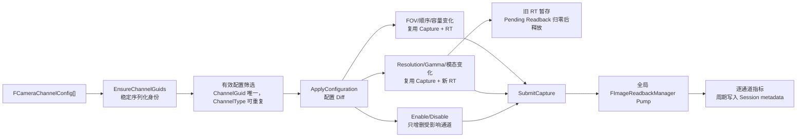

- `OnRegister` 创建 `FImageReadbackManager`，首次 `BuildChannels` 只负责建立初始运行时资源。
- 每条 `FCameraChannelConfig` 拥有序列化 `ChannelGuid`。缺失或重复 GUID 会自动修复；编辑器旧关卡的迁移进入事务并标记待保存，数组重排后仍按 GUID 匹配原资源。
- 同一 `ChannelType` 允许多条 Enabled 配置；运行时资源复用、RenderTarget 查询和像素格式查询均以 `ChannelGuid` 为键，`ChannelType` 只描述输出数据类型。
- `Instance` 使用普通 SceneCapture 工作目标建立视图，并使用独立的原生 `PF_R32_UINT` 目标保存正式输出；该通道不再被拒绝。
- `ApplyConfiguration` 比较有效 Channels、Resolution、FOV、Gamma 和 `MaxPendingReadbacks` 与已应用快照；资源配置相同时是 O(n) 空操作，不触碰 UObject 或 GPU 资源。
- `MaxPendingReadbacks` 通过原子容量快照安全热更新：缩容不取消在途任务，只约束后续 Enqueue，也不重建 Manager、Capture 或 RT。
- 编辑器 `PostEditChangeProperty`、正式 `SubmitCapture` 和 Debug Capture 都进入同一个热更新入口，避免编辑器预览与数据集采集使用不同配置。
- FOV 或数组顺序变化只重新配置 Capture，Capture 与 RenderTarget 都复用。
- Resolution/Gamma 变化复用 `USceneCaptureComponent2D`，只为受影响通道创建新 `UTextureRenderTarget2D`。
- 通道启用、禁用或删除只创建/销毁对应通道，未受影响通道保持原对象。
- 如果旧 Target 仍关联 Pending Readback，它会进入 `RetiredTargets` 保活；最后一个 Payload 交付后才注销 Semantic 身份并交给 GC，避免在途渲染命令持有悬空资源。
- `FCameraRigResourceStats` 记录配置 Apply/Change/No-op，以及 Capture/RT 的创建、复用、重建和销毁次数。
- 配置真正变化后广播 `OnConfigurationChanged`；Camera Adapter 为每个实际运行通道构建独立 Calibration，Dataset Session 按 `SensorName + ChannelGuid` Upsert，使不同模态/分辨率不会互相覆盖。
- Camera Adapter 每秒以及 `EndPlay` 前登记一次资源、Readback 聚合和按通道指标快照，最终写入 `metadata.json` 的 `renderer.camera_rigs`。
- `SubmitCapture` 已统一处理 RGB、Semantic、Depth 和正式的 32 位 Instance 通道。

通道配置：

| 通道 | CaptureSource | GPU RenderTarget | 正式 CPU Payload |
|---|---|---|---|
| RGB | `SCS_FinalColorLDR` | RGBA8 | RGBA8 |
| Semantic | `SCS_FinalToneCurveHDR` | Linear RGBA8 | RGBA8 标签 |
| Depth | `SCS_SceneDepth` | RGBA32F | 提取 R 后转换为 R32Float 米 |
| Instance | `SCS_FinalColorLDR` 工作视图 | 原生 `PF_R32_UINT` | 紧密排列的 R32Uint 标识符 |

#### 为什么 Depth 的 GPU Target 是 RGBA32F，而 CPU 是 R32Float

UE 5.7 的 Scene Capture 在 RGBA32F RenderTarget 上能可靠把 SceneDepth 写到逻辑 R。直接使用 R32F RenderTarget 的实测结果为全零，因此：

1. GPU 端使用 RGBA32F 保证 SceneCapture 兼容。
2. Readback 只提取逻辑 R。
3. UE 厘米乘 `0.01` 转为米。
4. 最终 CPU Payload 仍是紧密 R32Float，没有四通道带宽泄漏到数据集协议。

#### 相较旧架构修改了什么及原因

- **Depth 已从“未来通道”变为正式支持通道。**
  原因是 GPU Debug EXR、正式异步 BIN 和单位转换已通过验收。
- **Capture/RT 已从“仅逐帧复用”升级为配置 Diff 驱动的选择性复用。**
  原因是全量 `DestroyChannels → BuildChannels` 会让一个通道的 FOV 或分辨率变化同时抖动其他通道；现在只有真正受影响的资源发生变化。
- **运行时资源身份从 `ChannelType` 改为稳定 `ChannelGuid`。**
  原因是模态只描述数据类型，不能唯一表达配置身份；GUID 允许数组重排与属性热更新后继续复用正确资源，并为未来产品化多同模态输出保留身份基础。
- **同类型多通道已改为使用 ChannelGuid 独立寻址，Instance 也已成为正式通道。**
  Instance 不再把 LDR 颜色目标当作正式数据，而是拥有原生整数输出目标和精确的 uint32 协议；同一模态的多条配置则通过各自 ChannelGuid 独立创建、路由和完成计数。
- **旧 Target 增加 Pending Readback 排空前保活。**
  原因是热更新可能发生在 GPU Copy 尚未完成时；直接原地重建或释放会让已排队命令引用过期资源。
- **Calibration 从“每个 Rig 取第一条”改为逐运行通道登记。**
  原因是 RGB、Semantic、Depth 可以采用不同分辨率；`SensorName + ChannelGuid` Upsert 才能保证热更新后每份内参与实际图像一致。
- **`MaxPendingReadbacks` 改为原子容量热更新。**
  原因是容量策略变化不应销毁 Manager 或取消已提交的 GPU Copy；缩容只影响后续准入更安全。
- **Renderer 资源与逐通道 Readback 指标进入会话 metadata。**
  原因是只提供查询 API 无法在一次数据集采集结束后追溯拥塞来源；现在会话文件保留容量、拒绝/失败、资源复用及延迟快照。
- **调试保存增加预热捕获和 Shader 编译等待。**
  原因是命令行编辑器首次捕获可能早于验收材质 Shader 完成，导致棋盘格回退材质；这一同步等待只存在于 Debug Save，不进入正式逐帧路径。
- **增加无 DefaultPawn/HUD 的 `SensorSimulationGameMode`。**
  原因是默认 Pawn 曾进入 RGB 画面并形成无关的半圆形凸起。

#### R13-R14 真正的 32 位 Instance 路径（已完成）

#### 为什么要这样做

`CustomStencil` 只有 8 位，如果直接复用，会把 `0x01020304` 这样的 InstanceId 截断为 `4`。因此 Instance 必须使用独立的整数渲染路径。

#### 当前如何做

- `USemanticObjectComponent` 分别保存 SemanticId 和 uint32 InstanceId，并把每个图元注册到 `FInstanceCaptureRegistry`。
- `FInstanceCaptureTarget` 持有原生 `PF_R32_UINT` 纹理，因为当前 UE 5.7 环境中的 `UTextureRenderTarget2D` 无法提供所需的整数目标路径。
- 普通 SceneCapture 目标负责建立 View 和可见性集合；随后在 Tonemap 扩展点调用 `AddDrawDynamicMeshPass`，把结果绘制到独立整数目标。
- 每次绘制都显式绑定完整 InstanceId 和捕获 View 的 `TranslatedWorldToClip` 矩阵。这样可以避免后处理材质通道读取到不同的隐式 `ResolvedView` 静态槽位。
- 绘制通道使用 `CF_DepthNearOrEqual` 重建当前 Pass 独立的反向 Z 深度，从而保留最近的可见不透明表面，同时不借用池化 SceneDepth。
- 无输入像素着色器向 `SV_Target0` 写入一个 `uint`，不执行过滤、Gamma、Tonemap 或通道编码。
- Readback 会去除 GPU RowPitch 填充，生成紧密排列的小端 uint32 像素。协议要求 `R32Uint + Data + Identifier + 4 字节/像素`，Writer 按 ChannelGuid 导出 `instance_u32_<ChannelGuid>.bin`。

#### 相较旧架构修改了什么及原因

Instance 不再被拒绝，也不再使用 RGBA8 或 CustomStencil 表示。显式矩阵和静态 Uniform 绑定还使 D3D11/D3D12 的 PSO 契约保持确定。

#### R15 阶段 A（已完成，2026-08-04）

- Masked 绘制保留源材质并执行 UE 的材质裁剪路径，因此 Opacity Mask 孔洞保持为背景，WPO 仍能影响几何体。
- Opaque 绘制继续使用默认材质快速路径。
- Registry 会显式排除 Nanite 和 Translucent 图元，并说明 ISM/HISM 当前只提供组件级身份。
- 普通非 Nanite SkeletalMesh 继续通过动态网格路径处理。

这样做的原因是特殊对象并不共享同一套可见性契约。经典 Mesh Pass 可以精确实现 Masked 覆盖，但如果静默接受 Nanite、Translucent 或 ISM/HISM 逐实例语义，就会生成外观看似合理、实际错误的真值。

当前流程为：

`RegisterPrimitive → 特殊对象分类 → 支持项进入 Registry／不支持项显式排除 → 可见 MeshBatch → 默认 Opaque 材质／源 Masked 材质 → Pass 独立深度 + PF_R32_UINT`

#### R15 阶段 B（已完成，2026-08-11）

- [x] 已为 Actor 与 ISM/HISM 内部实例预留连续 ID 区间，Payload 合法值校验覆盖整个区间。
- [x] 官方 UE 5.7.2 Renderer 在后处理调用栈内借出 `FInstanceCullingManager`；Instance Pass 使用 `AddSimpleMeshPass` 复用正式 GPU Scene Primitive-ID 流。
- [x] Shader 同时处理 `USE_INSTANCING` 与 `USE_INSTANCE_CULLING`，两个 ISM 内部实例的不同 32 位 ID 已升级为强制断言，并在 D3D11/D3D12 通过。
- [x] 半透明产品策略已明确拆为 `Ignore` 与 `OpaqueProxy`：前者让玻璃后的对象写标签，后者由同 Actor 的不透明代理写玻璃自身标签。
- [x] Nanite 路径利用扩展上下文中的 `NaniteRasterResults`，在 VisBuffer 存活阶段解码 `PrimitiveId/RelativeId` 并输出稳定 InstanceId；D3D12 自包含真实像素断言通过。
- [x] 独立 HISM、Masked foliage、SkeletalMesh 与半透明双策略已纳入同一自动化用例，并在 D3D11/D3D12 获得一致的真实 GPU 像素结果。

##### 半透明双策略的数据流（已完成，2026-08-12）

为什么要做：感知训练需要透过汽车玻璃看到内饰、驾驶员和机器人内部结构，而玻璃检测、维修检测、破损识别或材质识别又需要玻璃自身拥有稳定标签。单一规则无法同时满足两种数据产品。

当前如何做：

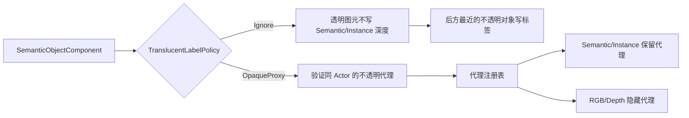

- `Ignore` 是默认值；真实半透明图元不写 CustomStencil，也不进入 Instance Registry，因此不会挡住后方标签。
- `OpaqueProxy` 要求 `OpaqueLabelProxy` 是同一 Actor 上已注册且材质非 Translucent 的 `UPrimitiveComponent`，代理继承该组件的 SemanticId/InstanceId。
- 代理设置为仅 SceneCapture 可见并进入 Renderer 注册表；Camera Rig 每次提交前刷新，RGB/Depth 隐藏代理，Semantic/Instance 保留代理，支持运行时新增和策略热更新。
- 从 `OpaqueProxy` 切回 `Ignore` 时会注销旧代理并恢复接管前状态；已配置但未启用的代理不会误写标签。

如何配置：感知训练对象选择 `Ignore`，无需设置代理；玻璃产品选择 `OpaqueProxy`，并把一个贴合玻璃外形的不透明代理组件赋给 `OpaqueLabelProxy`。代理几何越贴合玻璃，边界真值越准确。

编辑器产品化校验（已完成，2026-08-14）：

- [x] `IsDataValid` 将缺失代理、跨 Actor 代理和 Translucent 代理判为 Invalid，避免错误配置进入数据生产。
- [x] 未注册代理、同 Actor 缺少半透明源，以及代理与透明源包围盒偏差超过 `OpaqueProxyBoundsTolerance` 时给出警告。
- [x] 包围盒容差默认 0.2，可按汽车玻璃或机器人防护罩的代理近似程度逐对象调整。
- [x] `SensorSimulation.Rendering.OpaqueProxy.DataValidation` 已覆盖有效、缺失、跨 Actor、透明材质、错位和未注册六种情况。

运行时热切换与四模态隔离（已完成，2026-08-14）：

- [x] 代理的“视觉隔离生命周期”与“是否写标签”已解耦；切换到 `Ignore` 后，已配置代理仍保持主视口隐藏并继续被 RGB/Depth 排除。
- [x] 新增 `ApplyCaptureConfiguration()`，蓝图或 C++ 修改 SemanticId、策略或代理后可立即应用；Details 面板继续复用 `PostEditChangeProperty` 自动刷新。
- [x] `SensorSimulation.Rendering.OpaqueProxy.HotSwitchIsolation` 连续捕获 `OpaqueProxy` 帧和 `Ignore` 帧：Semantic/Instance 分别从代理标签切换到后景标签，RGB 不出现红色代理，Depth 始终读取后景距离。
- [x] D3D11 与 D3D12 使用同一四模态像素用例并全部通过。

下一步优化：评估代理三角面数预算和自动生成低精度代理工具。

##### UE Renderer 补丁化与兼容守卫（已完成，2026-08-14）

为什么要做：R15 依赖官方 UE 5.7.2 未公开的 Renderer 栈内对象。若只在某台机器手工修改引擎，换电脑、重装引擎或升级小版本后，插件可能无法编译，或者在错误生命周期读取 Renderer 数据。

当前如何做：

- [x] `Tools/EnginePatches/UE5.7.2/SensorSimulationRendererContext.patch` 保存相对官方 `5.7.2-release` 的两个文件最小补丁。
- [x] `manifest.json` 固定引擎版本、Compatible Changelist、修改文件、导出 API 和生命周期契约。
- [x] `check_renderer_patch.ps1` 检查 `Build.version` 与六个必需特征，并可输出 JSON 验收报告。
- [x] `RendererCompatibility.h` 将私有 Renderer API 集中到一个入口；非 UE 5.7.2 会在编译期报错，字段或函数签名漂移也会在该兼容层局部失败。
- [x] 补丁通过 `git apply --reverse --check`，证明当前引擎能够精确反向还原到官方基线。

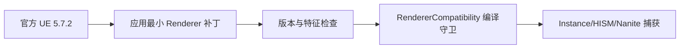

##### Renderer 构建前置门禁与手动 CI（已完成，2026-08-14）

为什么要做：Renderer 源码编译耗时较长。如果引擎版本或补丁缺失，应该在调用 UBT 前失败，并给本地构建机与 CI 返回同一种机器可读结果。由于 UE 官方源码需要授权，CI 还必须限定到隔离的自托管 Runner，不能让未审查 PR 自动执行构建机上的代码。

当前如何做：

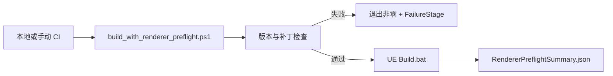

- [x] `build_with_renderer_preflight.ps1` 是统一入口，支持 `UE_ENGINE_ROOT`、显式参数和 `-SkipBuild` 检查模式。
- [x] 补丁检查不通过时不会调用 `Build.bat`；汇总报告记录 `PreflightPassed`、`BuildRequested`、`BuildExitCode` 与 `FailureStage`。
- [x] `.github/workflows/renderer-preflight.yml` 只允许手动触发，并要求带 `ue-5.7.2` 标签的 Windows x64 自托管 Runner。
- [x] Checkout 禁止持久化凭据；官方 Actions 固定到 v7.0.1 提交，报告无论成功失败都会作为 Artifact 上传。
- [x] 成功路径得到 `Passed=true`、`BuildExitCode=0`；不存在引擎路径的故障注入以退出码 1 停在 `RendererPatchCheck`。

下一步优化：配置隔离的自托管 Runner 并首次手动运行工作流；完成安全评审前不开放 PR 自动触发。手动 CI 稳定后，再把 D3D11/D3D12 像素矩阵接到构建成功之后。

详细证据和后续接入方案见 ImplementationRoadmap.md 的“R15 阶段 B 实施审计”。

#### 验收状态

D3D11 和 D3D12 已分别通过真实 PIE/GPU 大 ID 生命周期测试、带 RowPitch 填充的 R32Uint 转换测试和 ExportService Writer 生命周期测试。证据位于：

- `Saved/Acceptance/R13_R14_Instance32/Run30_FinalD3D12`
- `Saved/Acceptance/R13_R14_Instance32/Run31_FinalD3D11`
- `Saved/Acceptance/R15_SpecialObjects/UE572_OfficialRenderer/D3D12_ISM_RequiredAssertion.log`
- `Saved/Acceptance/R15_SpecialObjects/UE572_OfficialRenderer/D3D11_ISM_RequiredAssertion.log`
- `Saved/Logs/R15_NanitePixelDiscardFix_DX12.log`
- `Saved/Acceptance/R15_SpecialObjects/UE572_CrossRHI_Matrix/D3D12.log`
- `Saved/Acceptance/R15_SpecialObjects/UE572_CrossRHI_Matrix/D3D11.log`
- `Saved/Acceptance/R15_SpecialObjects/UE572_TranslucentPolicies/D3D12.log`
- `Saved/Acceptance/R15_SpecialObjects/UE572_TranslucentPolicies/D3D11.log`

最终跨 RHI 特殊对象矩阵：

| 验收项 | D3D11 | D3D12 | 判定依据 |
|---|---|---|---|
| 独立 HISM 逐内部实例 | 通过 | 通过 | 两个内部 ID `16912385`、`16912386` 同时存在 |
| Masked foliage 风格裁剪 | 通过 | 通过 | 前景 `16916481:280`，孔洞后景 `16920576:216` |
| SkeletalMesh 动态路径 | 通过 | 通过 | ID `16924672:8` |
| Translucent Ignore | 通过 | 通过 | 透明前景 ID `16928768` 不存在，后景 `16932864:236` |
| Translucent OpaqueProxy | 通过 | 通过 | 代理 `16936960:220`，被遮挡后景 ID `16941056` 不存在 |
| Nanite 专用路径 | 不适用 | 通过 | D3D12 VisBuffer 用例中 Nanite ID `16909312:20` |

#### 下一步做什么/如何优化

- [x] RenderTarget 查询、Payload 路由、文件命名和预期图像通道已从 `ChannelType` 寻址升级为 `ChannelGuid` 寻址，同一 `ChannelType` 多配置已经放开。
- [x] Camera Adapter 持有稳定 SensorGuid；Calibration、Renderer 指标和异步 Payload 均以该身份关联，Rig 的 SensorName 可独立热改。

### 4.2 Semantic 无颜色后处理污染流程

#### 为什么要这样做

Semantic ID 是离散整数，不是显示颜色。Tonemap、Gamma、TAA/FXAA、Bloom、Motion Blur 和双线性采样都可能产生不存在的中间标签。

#### 当前如何做

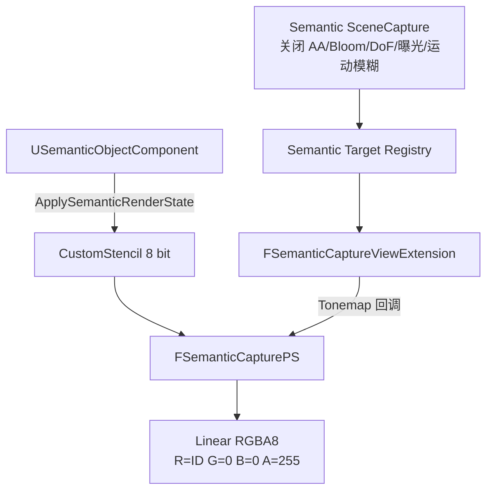

1. `USemanticObjectComponent` 给所属 Actor 的全部 `UPrimitiveComponent` 启用 CustomDepth，并写入 8 位 CustomStencil。
2. Camera Rig 创建 Semantic RenderTarget 后，把对应 `FRenderTarget*` 注册到线程安全集合。
3. View Extension 通过 `ViewFamily->RenderTarget` 是否已注册来识别 Semantic View。
4. 只在 Tonemap Pass 注册 `RenderSemanticLabels`。
5. Global Shader 使用整数像素位置读取 CustomStencil，不采样 SceneColor。
6. Shader 按有效 `ViewRect` 而不是池化纹理 Extent 计算像素坐标。
7. 输出固定为 `R=SemanticId/255,G=0,B=0,A=1`，落到线性 RGBA8 后恢复为精确标签字节。

#### 相较旧架构修改了什么及原因

- **Semantic View 身份从 `CaptureSource == FinalToneCurveHDR` 改为显式 RenderTarget 注册表。**
  原因是 CaptureSource 只描述渲染内容和时序，其他业务也可能使用相同枚举；把它当身份哨兵会误接管其他 Capture。
- **不再依赖 `ProfilingEventName` 传播到渲染线程。**
  原因是 UE 5.7 实测没有稳定传播到 `ViewFamily`；ProfilingEventName 现在只用于调试标识。
- **Shader 输入签名保留 `TEXCOORD0` 与 `SV_POSITION` 的寄存器顺序。**
  原因是 D3D12 PSO 对 VS/PS 输入签名兼容性更严格。
- **像素位置使用有效 ViewRect。**
  原因是奇数分辨率下 RDG 池化纹理可能大于实际 Capture Viewport，使用 Extent 会发生边缘错位。

#### SemanticId 非法值策略

- 背景固定为 0。
- 图像对象标签只允许 1..255。
- 非法值不再静默 Clamp。
- 非法对象退出 Semantic 图，但完整 SemanticId 仍保留给 LiDAR 和 Ground Truth。
- Runtime 校验 Semantic 图中每个像素必须属于当前注册 ID 集合，并满足 `G=0,B=0,A=255`。

改变原因：Clamp 会把不同非法类别合并成 0 或 255，生成“看起来合法但语义错误”的数据，比显式拒绝更危险。

#### 下一步做什么/如何优化

- R15：覆盖 Nanite、Masked、半透明、植被、ISM/HISM、SkeletalMesh 和多 Primitive Actor。
- 把 Runtime 全图合法性扫描移到 SIMD、TaskGraph 或 GPU Reduction。
- 日志记录第一个非法像素坐标、RGBA 和合法 ID 集合。
- [x] 半透明产品策略已明确为可逐对象选择的 `Ignore` / `OpaqueProxy`，并完成 D3D11/D3D12 像素回归。

### 4.3 异步 GPU Readback

#### 为什么要这样做

同步 `ReadPixels()` 会让游戏线程等待渲染线程和 GPU，破坏固定频率采集。正式管线必须使用 Fence 驱动的异步 GPU Copy；同步 PNG/EXR 导出只能用于人工调试。

#### 当前如何做

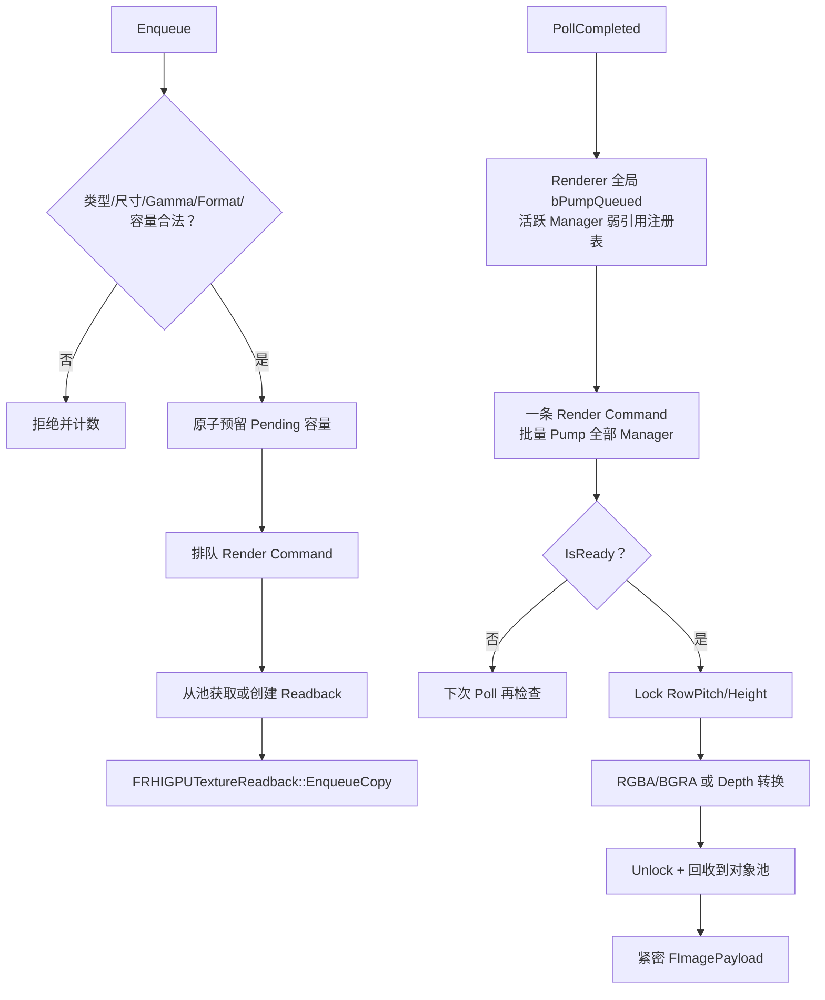

线程边界：

- 游戏线程：验证 UObject 属性、原子预留容量、提交命令、消费 Completed Queue。
- 渲染线程：取得 RHI Texture、提交 GPU Copy、检查 Fence、Lock/Unlock、执行当前 CPU 格式转换。
- CPU Payload：拥有独立 `TArray<uint8>`，Unlock 后不再依赖 staging resource。

格式转换：

- `PF_R8G8B8A8`：逐行紧密复制。
- `PF_B8G8R8A8`：逐像素交换 R/B，输出统一 RGBA8。
- `PF_R32_FLOAT`：逐行复制并从厘米转米。
- `PF_A32B32G32R32F`：只提取逻辑 R，并从厘米转米。
- 所有路径都检查 `RowPitchInPixels >= Width` 和 BufferHeight。

Readback 对象池：

- 以 `ImageSize + PixelFormat` 匹配可复用对象。
- Fence 完成且 Unlock 后回收到池。
- 不会把不同尺寸或格式的 staging resource 混用。

当前指标分三层：

- Manager 聚合：Capacity、Pending、PeakPending、Enqueued、Completed、Rejected、Failed、Created/ReusedReadbackResources。
- `SensorGuid + PayloadType` 通道：上述容量与结果计数，另含 Delivered、平均/最大 GPU Readback 延迟、平均/最大端到端交付延迟。
- Renderer 全局 Pump：当前/峰值注册 Manager 数、PumpCommandCount、累计访问 Manager 数和单次最大批量。

`UCameraRigComponent::GetImageReadbackStats()` 和 `GetImageReadbackChannelStats()` 向上层提供快照；`FImageReadbackManager::GetGlobalPumpStats()` 提供全局协调器快照。Runtime Camera Adapter 每秒和退出前把 Rig 快照登记到 Dataset Session。

#### 相较旧架构修改了什么及原因

- **转换逻辑从 Manager 拆到 `ImageReadbackConversion.*`。**
  原因是 RowPitch、BGRA/RGBA 和 Depth 单位转换需要脱离 GPU 做自动化测试。
- **增加对象池。**
  原因是高频采集时反复创建 staging/readback resource 会造成 RHI 分配抖动。
- **把每 Manager 的 `bPumpQueued` 提升为 Renderer 全局协调器。**
  原因是多台 Camera 各自 Poll 时，单 Manager 合并仍会产生多条渲染命令；现在任一 Poll 只触发一条命令，并通过弱引用快照批量检查全部活跃 Manager。
- **指标从 Manager 总量扩展为 `SensorGuid + PayloadType`。**
  原因是总量只能说明“某处拥塞”，无法定位具体相机和 RGB/Semantic/Depth 通道；延迟也必须在 Enqueue、GPU 完成和游戏线程领取三个时刻分别记录。

#### 当前边界

- 全局 Pump 目前仍由 `PollCompleted` 驱动，而不是 Renderer Ticker 主动推进；只要 Camera Adapter 正常 Tick 就会持续工作。
- 大块像素转换仍发生在渲染线程。
- Camera Rig 指标已周期性写入 Dataset metadata；全局 Pump 指标目前仍只提供进程级查询，尚未写入会话文件。
- Destructor 通过共享状态保证排队命令不会访问已销毁 Manager；D3D12 自动化已覆盖组件反复注册、PIE Stop、关卡切换和带 Pending Readback 退出。

#### 下一步做什么/如何优化

- R8/R10 基础闭环及 Camera Rig 指标落盘已完成；下一步评估是否把全局 Pump 指标也写入会话，并改为 Renderer Ticker 主动 Pump。
- R11 已完成基础闭环；下一步扩充多相机并发销毁、模块卸载和 RHI 设备重建等更强压力场景。
- 评估把 CPU 格式转换移到 TaskGraph/Worker，但必须先复制或映射出不依赖 Lock 生命周期的数据。

---

## 5. SimulationRuntime：调度、适配、校验、聚合与导出

### 5.1 运行时设置与时钟

#### 为什么要这样做

实时预览追求不卡顿；确定性数据集采集追求稳定顺序和可复现性。两者在背压和是否允许同时存在多个 Pending Frame 上需要不同策略。

#### 当前如何做

`USimulationSettings` 提供：

- `SimulationMode`：Realtime 或 DeterministicDataset。
- `FixedStepSeconds`：固定采集间隔。
- `FrameTimeoutSeconds`：等待模态到齐的超时时间。
- `RandomSeed`：确定性模式随机种子。
- `MaxPendingFrames`：Export Queue 容量。
- `DatasetRoot`：数据集根目录。

`FSimulationScheduler` 独立保存采样时间轴和暂停原因；Subsystem Tick 只在游戏线程安全点泵送决策与执行 UObject 捕获。

- Realtime：继续把 DeltaTime 累积为固定采样间隔，每个游戏 Tick 最多发起一帧。
- DeterministicDataset：完全忽略 DeltaTime；只有 FrameAssembler 流水线为空且 Export 有容量时才推进一个 `FixedStepSeconds`。
- Export 满时暂停原因显式为 `ExportBackpressure`；上一帧未完成时为 `FramePipelineBusy`，两者都不改变确定性时间戳。
- 确定性模式初始化 `Rand` 与 `SRand` 种子；帧超时另用会话单调时钟，不会随确定性时间轴暂停。
- Session 启动时把 Settings CDO 复制到 `FSimulationRuntimeSettingsSnapshot`，当前会话不再重复读取 CDO。
- 空 `DatasetRoot` 固定解析为 `Project/Saved/SensorSimulation`；相对路径固定锚定 `Project/Saved`，逃逸路径被拒绝；绝对路径原样规范化。

#### 相较旧架构修改了什么及原因

- **固定步长、随机种子、帧超时和导出容量已经进入项目设置。**
  原因是这些参数会直接改变数据集可复现性和背压行为，不应散落为硬编码。
- **确定性模式由独立调度状态机推进固定时间戳。**
  原因是游戏帧 DeltaTime、渲染卡顿和 Export IO 不应改变数据集采样序列。
- **背压从阻塞调用线程改为显式暂停。**
  原因是完整帧可留在 FrameAssembler 等待 Export 空位，无需在游戏线程 Sleep，也不会丢失或误超时。
- **设置与输出目录在 Session 启动时固化。**
  原因是同一数据集会话必须始终使用同一模式、步长、容量、超时、Seed 和绝对根目录。

#### 下一步做什么/如何优化

- [x] 确定性时间轴已由 `FSimulationScheduler` 独立管理，游戏 Tick 不再用 DeltaTime 推进确定性采样。
- [x] `PauseDatasetClock` 已取代阻塞等待；Export 满时调度器显式暂停，Worker 使用事件唤醒且无 Sleep 轮询。
- [x] 相对 `DatasetRoot` 已统一解析到 Project/Saved，并拒绝 `..` 逃逸；绝对路径继续支持。
- [x] `FSimulationRuntimeSettingsSnapshot` 已固化当前 Session 设置，采集中修改 CDO 只影响下一次 Session。
- 下一步增加命令行覆盖快照、暂停时长/原因指标，以及不同游戏帧率下端到端数据集哈希复现测试。

### 5.2 传感器基类与 Camera Adapter

#### 为什么要这样做

Camera 和 LiDAR 的采集方式不同，但 Subsystem 需要统一注册、查询能力并下发 `FCaptureRequest`。

#### 当前如何做

- `USimSensorComponentBase::BeginPlay/EndPlay` 自动注册和注销。
- `GetPayloadTypes` 报告传感器能力。
- `RequestCapture` 是统一采集入口。
- Camera Adapter 自动查找同 Actor 的 `UCameraRigComponent`。
- Camera Adapter 为每条实际启用的图像通道分别注册标定参数，并按 `ChannelGuid` 更新同一通道。
- Camera Adapter 每 Tick 清空 Readback Completed Queue，并移动提交给 Subsystem。

#### 相较旧架构修改了什么及原因

- **Camera 能力已从 RGB/Semantic 扩展为 RGB/Semantic/Depth。**
  原因是 Depth 已进入正式 Readback 和 Runtime 校验路径。
- **Camera Adapter 会向 DatasetSession 注册 Calibration。**
  原因是数据集消费者需要从像素坐标恢复射线或三维位置。

#### 下一步做什么/如何优化

- [x] RenderTarget、Readback/Payload 路由、FrameAssembler 图像预期和文件命名已统一使用 ChannelGuid；同一 ChannelType 多配置已解除运行时过滤。
- Camera Rig 缺失时输出明确错误并禁用 Adapter。
- [x] `RequestCapture` 已返回 `Accepted/Busy/Rejected`，Readback 队列满或资源无效会立即反馈给 FrameAssembler。
- [x] 每个实际启用的相机通道已使用独立 Calibration，并通过 `SensorGuid + ChannelGuid` 登记和热更新。
- 使用集中完成通知替代每个 Camera Adapter 每 Tick Poll。

### 5.3 Semantic Registry 与图像校验

#### 为什么要这样做

Shader 正确不代表最终 Payload 一定正确。Gamma、RHI 通道顺序、尺寸、RowPitch 或非法标签都可能在 GPU Copy 或协议边界破坏数据。

#### 当前如何做

- Registry 为运行时语义对象分配会话内 `InstanceId`。
- Registry 保存 Actor → Semantic Component 弱引用。
- Registry 收集背景 0 和当前有效 8 位 SemanticId。
- Runtime 在图像进入 FrameAssembler 前验证格式、尺寸、字节数和 RowStride。
- Semantic 额外执行逐像素合法 ID 与 RGBA 约束检查。
- Depth 必须是 `R32Float + Data + Meters`。

#### 相较旧架构修改了什么及原因

- **非法 SemanticId 从 Clamp 改为显式拒绝图像标签。**
  原因是静默 Clamp 会制造合法外观的错误类别。
- **校验从“所有图像都是 RGBA8”扩展到按模态验证。**
  原因是 Depth 同样是 4 字节/像素，但其含义是 float32 而不是四个颜色字节。

#### 下一步做什么/如何优化

- Registry 主动清理失效弱引用。
- 为 Instance 图维护合法的 uint32 InstanceId 集合。
- 校验失败日志增加第一个错误像素坐标和值。
- 将全图扫描移出游戏线程。

### 5.4 LiDAR

#### 为什么要这样做

一次执行完整扫描的所有同步 Trace 会阻塞单帧，因此扫描必须分批推进；但完整扫描仍必须回到同一个 FrameId。

#### 当前如何做

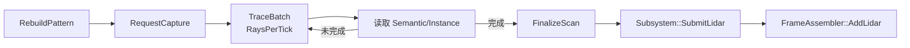

- `RebuildPattern` 预生成局部射线方向。
- `RequestCapture` 初始化带 Header 的 ActiveScan。
- `TraceBatch` 每 Tick 只执行 `RaysPerTick` 条射线。
- 命中点转换为传感器局部米制坐标。
- 命中 Actor 的 SemanticId/InstanceId 写入点。
- `FinalizeScan` 验证 `CompletedRayCount == ExpectedRayCount`，随后提交 Subsystem。

#### 相较旧架构修改了什么及原因

- **`FinalizeScan → SubmitLidar` 已闭环。**
  原因是只广播 Delegate 无法让 FrameAssembler 收到 LiDAR Payload。

#### 下一步做什么/如何优化

- 当前传感器变换使用 Owner Actor Transform；应改用组件世界变换，支持一个 Actor 上安装多个 LiDAR。
- 使用 UE Async Trace 或任务化批处理。
- 增加运动畸变、噪声、漏检、多回波和材质反射率模型。
- `FinalizeScan` 当前移动 `ActiveScan` 后再广播同一对象；应调整顺序或广播不可变副本，避免监听者收到 moved-from 数据。

### 5.5 FrameAssembler

#### 为什么要这样做

不同模态异步完成；整帧只有在全局预期模态和每个已注册传感器的预期模态都满足时才能发布。

#### 当前如何做

- `BeginFrame` 创建待完成 Packet 并记录创建时间。
- `RegisterSensor` 保存 `FrameId → SensorGuid → SensorName + Expected/Completed`。
- `RequestCapture` 用 `Accepted/Busy/Rejected` 表示接纳结果；非 Accepted 通过 `FailFrame` 立即终止整帧。
- Camera 请求额外携带 `ExpectedImageChannels`；`AddImage` 按 `SensorGuid + ChannelGuid` 校验预期类型和完成状态，同一 RGB 的多条配置不会被一个模态位提前满足。
- `AddLidar` 继续按 SensorGuid + LiDAR 模态更新传感器状态。
- `AddGroundTruth` 完成真值模态，同一 FrameId 的重复真值也会被拒绝。
- `CheckAndEnqueueComplete` 先检查整帧和逐传感器状态，再用 `EnqueuedCompleteFrames` 保证 FrameId 只入完成队列一次。
- `PurgeTimedOutFrames` 清理超时帧、记录缺失状态，并将 FrameId 标记为 `TimedOut`。
- `PopCompleteFrame` 使用移动语义发布，将 FrameId 标记为 `Completed` 后清理关联状态。
- 最近 1024 个 `Completed/Failed/TimedOut` FrameId 构成有限终态历史；迟到 Payload 直接丢弃并计数。

#### 相较旧架构修改了什么及原因

- **增加按传感器完成状态。**
  原因是单一位掩码无法表达“两台相机各需要一张 RGB”。
- **完成键从 SensorName 改为 SensorGuid。**
  原因是名称允许重复和热改；持久 GUID 才能在请求、GPU Readback、LiDAR、Calibration、指标与导出之间保持同一身份。
- **图像文件始终使用完整 ChannelGuid 后缀。**
  例如 `rgb_<32位ChannelGuid>.png`、`depth_meters_f32_<32位ChannelGuid>.bin`；文件身份不依赖 ChannelType、SensorName 或同模态数量，配置增删和改名不会改变剩余通道的文件名。
- **增加 Timeout 与统计。**
  原因是读回拒绝、传感器 Busy 或缺失组件都可能让帧永远不完整。

#### 下一步做什么/如何优化

- [x] 使用稳定 Sensor GUID，SensorName 只作为显示名称；同名传感器自动化回归已覆盖。
- [x] 重复 Payload 与重复完成队列项已分别由逐传感器完成状态和 `EnqueuedCompleteFrames` 阻止。
- [x] `Accepted/Busy/Rejected` 已与 `FailFrame` 闭环；Busy、Rejected、Timeout、Duplicate、Late 均独立统计并写入 `metadata.json`。
- [x] 迟到策略已定义：终态历史命中的 Payload 一律丢弃并增加 `LatePayloads`；历史按 FIFO 保留最近 1024 帧。
- 增加 Pending Frame 上限和更细的人工取消原因。
- `MissingModalities` 日志补充 Depth 与 Instance。

### 5.6 ExportService 与 DatasetSession

#### 为什么要这样做

PNG 编码和磁盘 IO 的耗时与 GPU 采集不同步，不能占用游戏线程。数据集还需要统一目录、标定、会话统计和可解释的文件协议。

#### 当前如何做

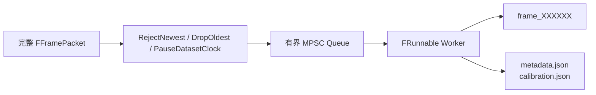

Export Worker：

- `Start` 创建输出目录并启动低优先级线程。
- `Run` 消费完整帧，队列为空时等待 `FEvent`；Enqueue 和 Stop 负责唤醒，不再轮询 Sleep。
- `Stop` 等待 Worker 结束；退出前排空队列。
- 统计成功和失败写出帧数。

当前文件：

| 文件 | 内容 |
|---|---|
| `rgb.png` | RGBA8 Payload 转为 PNG Writer 所需 BGRA 后编码 |
| `semantic.png` | 精确标签 RGBA8 PNG |
| `depth_meters_f32.bin` | 紧密 little-endian float32 米 |
| `lidar.bin` | 每点 float32 x/y/z/intensity，共 16 字节 |
| `groundtruth.json` | InstanceId、SemanticId、位姿、速度和包围盒 |
| `frame_info.json` | FrameId、SequenceId、时间戳和各类数据数量 |
| `metadata.json` | Session、模式、随机种子、帧统计、坐标约定和版本 |
| `calibration.json` | 相机尺寸、内参和 SensorToEgo |

背压策略：

- Realtime 默认 `RejectNewest`。
- `DropOldest` 已有实现但当前 Subsystem 不选择它。
- DeterministicDataset 使用非阻塞 `PauseDatasetClock`；队列满时完整帧留在 FrameAssembler，调度器保持时间戳不动。

#### 相较旧架构修改了什么及原因

- **ExportService 已从骨架变为完整后台 Worker。**
  原因是第一轮正式链路需要验证 RGB、Semantic、Depth 真正落盘。
- **DatasetSession 管理会话目录、标定和 metadata。**
  原因是单独的帧文件不足以解释坐标系、相机参数和采集配置。
- **Subsystem Deinitialize 先 Stop Worker 再写 Session Metadata。**
  原因是元数据统计必须在所有已排队帧完成写出之后生成。

#### 下一步做什么/如何优化

- 使用临时文件加原子 Rename，避免进程异常时留下看似完整的半文件。
- 检查每个 Writer 的返回值；`frame_info.json` 当前返回值未计入整帧成功状态。
- 为 Depth/Instance 文件增加格式版本、字节序和无效值说明。
- LiDAR 当前导出不包含 Point 中已有的 SemanticId、InstanceId 和 RelativeTime，需要定义扩展格式或伴随文件。
- 把 Export 指标写入 metadata，并记录 Reject/Drop 的 FrameId。
- [x] 已移除 `BlockDatasetClock` 的游戏线程忙等待；兼容别名保留，但行为已转为非阻塞暂停。
- 下一步把暂停次数、累计暂停时长和 Export 高水位写入 metadata。

---

## 6. 关键对象关系

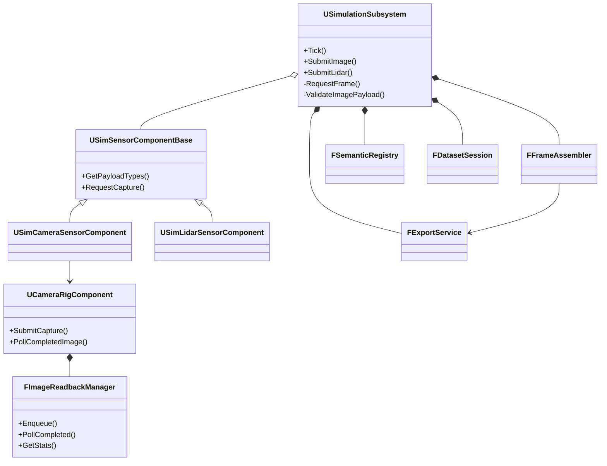

---

## 7. 线程、队列和所有权

| 对象/数据 | 线程 | 当前所有权 |
|---|---|---|
| `USimulationSubsystem` | 游戏线程 | World Subsystem |
| Sensor Components | 游戏线程 | Actor/Component |
| Scene Capture 配置和动态组件 | 游戏线程 | Camera Rig |
| Semantic Target 注册集合 | 游戏线程写、渲染线程读 | 全局集合 + `FRWLock` |
| Global Shader / RDG Pass | 渲染线程 | View Extension |
| Pending/Reusable `FRHIGPUTextureReadback` | 渲染线程 | Readback Shared State |
| Completed 图像队列 | 渲染线程生产、游戏线程消费 | MPSC |
| `FImagePayload::Bytes` | 创建后移交游戏线程 | 独立 CPU 内存 |
| `FFrameAssembler` | 游戏线程 | Subsystem 成员 |
| Export Pending Queue | 游戏线程生产、Worker 消费 | MPSC |
| 文件 Writer | Export Worker | `FExportService::FImpl` |
| Dataset Session | 游戏线程 | Subsystem 成员 |

### 为什么要明确所有权

最危险的不是一次同步操作，而是排队命令在 UObject 或 Manager 销毁后仍访问旧地址。当前 Readback 使用线程安全共享状态延长命令依赖数据的寿命；Semantic Target 在销毁资源前先注销。

### 当前边界与下一步优化

- 为游戏线程/渲染线程专属函数增加 `check(IsInGameThread())` 或 `check(IsInRenderingThread())`。
- R11 生命周期测试覆盖 PIE Stop、关卡切换、组件反复注册和带 Pending Readback 退出。
- Export Worker 不应访问 UObject；当前只消费值类型 Packet，保持这一边界。
- 评估关闭时是否需要显式 Flush Render Commands，必须避免在普通逐帧路径引入同步等待。

---

## 8. 验收、自动化与兼容状态

### 为什么要单独记录

“代码存在”不等于“跨 RHI、非规则分辨率和长序列下正确”。架构文档需要区分实现状态与验证范围。

### 当前验证结果

- `SensorSimulation` Automation：12 项通过、0 项失败。
  - 坐标转换。
  - RGBA RowPitch。
  - BGRA → RGBA。
  - 非法 RowPitch 拒绝。
  - R32F Depth 厘米 → 米。
  - RGBA32F 提取逻辑 R → 米。
  - SemanticId 合法范围。
  - Camera Rig 反复注册、PIE 中带待读回任务停止运行，以及关卡切换。
  - Export Worker Stop、重复 Stop、Restart 和退出前 Drain。
  - 两个 Manager 的 Poll 合并为一条全局 Pump 命令。
  - Front RGB 与 Rear Semantic 拒绝指标按通道独立归属。
- D3D11/D3D12：
  - 641×359 Semantic 均通过。
  - 解码后的 RGBA 像素逐像素一致。
- RGB/Semantic：
  - 红、绿、蓝、白 Unlit Cube。
  - SemanticId 为 10、20、100、200。
  - RGB 与 Semantic 区域对齐。
- Depth：
  - Debug EXR 有效。
  - 正式 `depth_meters_f32.bin` 有效。
- 稳定性：
  - 正式异步链路生成 1,067 帧。
  - 第 1 帧和第 1000 帧的 Depth 与 Semantic 哈希一致。
  - 日志未发现 Readback 拒绝、ViewRect 失败、无效 Buffer 或队列满。

主要证据位于：

`Saved/Acceptance/RendererOwner_20260723`

全局 Pump 与通道指标增量证据位于：

`Saved/Acceptance/RendererOwner_20260725/08_GlobalPumpMetrics`

全局 Pump 实现闭环及 R17/R18 热更新、资源复用证据位于：

`Saved/Acceptance/RendererOwner_20260725/09_HotReloadResourceReuse`

稳定 ChannelGuid、逐通道标定、容量热更新和指标落盘证据位于：

`Saved/Acceptance/RendererOwner_20260725/11_ChannelIdentityMetrics`

其中聚焦自动化结果为 Readback 8/8、DatasetSession 2/2、D3D12 CameraRig 1/1，均为 0 Warning / 0 Failed；目录同时保存 `SampleChannelCalibration.json` 和 `SampleRendererMetadata.json`。

### 当前验证边界

- [x] `SensorSimulation.Rendering.OutputMatrix.AllModalities` 已在一次真实 GPU 捕获中覆盖 RGB/Semantic/Depth/Instance，以及 32×24 偶数和 17×11 奇数 ViewRect。
- [x] D3D11 与 D3D12 使用同一测试入口；格式、颜色空间、单位、ViewRect、RowStride、字节数、合法标签、米制深度和完整 uint32 InstanceId 均通过。
- [x] `Tools/run_renderer_output_matrix.ps1` 已把双 RHI 小尺寸基线收口为单入口，并生成 `RendererOutputMatrixSummary.json`。
- [x] `Tools/run_renderer_output_matrix_phase2.ps1` 已覆盖 640×480/1280×720、7 个连续 SceneCase（含相机前移与复位）、背压/时延/复用指标，并生成 `RendererOutputMatrixPhase2Summary.json`。
- [x] `SensorSimulation.Rendering.OutputMatrix.Phase3.FourRigConcurrentContinuousMotion` 已在 D3D11/D3D12 覆盖四方向 Rig、6 步联合连续运动、16 通道路由、全局 Pump 和逐 Rig Busy。
- [x] Instance Pass 通过每个 View 的 Uniform Buffer 取得投影矩阵，避免多分辨率 D3D12 SceneCapture 串用逐 Draw 参数。
- [x] OpaqueProxy 激活时输出代理标签；Ignore 时 Instance View 隐藏未激活代理并恢复后景标签，RGB/Depth 始终不包含标签代理。
- [x] 独立 HISM、Masked、SkeletalMesh、Translucent Ignore/OpaqueProxy 与 D3D12 Nanite 已有特殊对象自动化。
- [x] `SensorSimulation.Rendering.OutputMatrix.Phase4.PendingRigDestroyRebuild` 已在 D3D11/D3D12 验证单 Rig 带 4 个 Pending Readback 销毁、其余三台继续交付、同 GUID 重建和全局 Manager 注册数恢复。
- [x] `SensorSimulation.Rendering.OutputMatrix.Phase5.ChannelDisableRestore` 已在 D3D11/D3D12 验证 Pending 期间禁用 Semantic、旧 Target 安全退休、三模态继续提交及同 ChannelGuid 恢复。
- Instance 生命周期、四方向并发、单 Rig Pending 销毁/重建和通道热开关已经自动化；模块卸载、RHI 重置、Pending 关卡切换和多 Rig 同时退出仍未完成。

### 下一步做什么/如何优化

1. [x] 已把四模态双 RHI 小尺寸基线收口为单入口测试命令和机器可读 JSON 汇总报告。
2. [x] `RHI × Resolution × Modality × SceneCase` 已覆盖 640×480、1280×720、Actor 运动、相机前移/复位、遮挡、OpaqueProxy 和 Ignore。
3. [x] 阶段 2 报告已记录 Readback Accepted/Busy/Rejected、GPU/交付时延、Pending 峰值和资源复用。
4. [x] 阶段 3 已覆盖相机组与 Actor 同时连续平移、四方向多 Rig 并发、Busy、GUID 路由和全局 Pump。
5. [x] 阶段 4 已覆盖单个 Rig 带 Pending Readback 销毁、其他 Rig 不受阻塞、同身份重建及重新加入全局 Pump。
6. [x] 阶段 5 已覆盖 Pending 期间单通道禁用、旧 Target 退休保活、其余通道继续提交和原 ChannelGuid 恢复。
7. [下一步] 扩充相机旋转/独立抖动、多 Rig 同时退出、Pending 关卡切换、模块卸载和 RHI 重置压力场景。
8. [下一步] 将 Export/FrameAssembler 端到端吞吐和超时指标并入 Renderer 输出矩阵报告。

---

## 9. 当前完成度与推荐顺序

### 已完成

- R3：清理验收场景。
- R4～R6：RGB 正确性、通道顺序和 Semantic 对齐。
- R7：显式 Semantic View 标识。
- R8：Renderer 全局 Readback Pump。
- R10：`SensorGuid + ChannelGuid` 通道指标、GPU/交付延迟与全局 Pump 指标。
- R11：Camera Rig/Readback 与 Export Worker 生命周期基础自动化。
- R9：Readback 对象池。
- R17：Channels/Resolution/FOV/Gamma/Readback Capacity 配置热更新、稳定 ChannelGuid 与逐通道 Calibration 同步。
- R18：Capture/RenderTarget 选择性复用、退休 Target 生命周期保护、资源指标及会话 metadata 落盘。
- ChannelGuid 寻址：同类型多通道的 RenderTarget、Readback/Payload、FrameAssembler 预期项、文件名和元数据已闭环。
- R12：Depth Channel。
- R13-R14：真正的 32 位 Instance Mesh Pass、R32Uint 读回与协议、Writer，以及跨 RHI 生命周期验收。
- R16：SemanticId 非法值策略。
- LiDAR → Subsystem。
- 按传感器 FrameAssembler、Timeout。
- Export Worker、Dataset Session 和正式文件 Writer。

### 基本完成但仍需收口

- R1：D3D12 Semantic 脚本化自动验收，尚未完全纳入 UE Automation Framework。
- R2：D3D11/D3D12 Semantic 矩阵，尚未覆盖所有模态。

## 10. 最小运行时装配

Camera Actor（相机角色）：

- `UCameraRigComponent`
- `USimCameraSensorComponent`
- Channels 中启用 RGB、Semantic、Depth 和/或 Instance。

Semantic Actor（语义对象角色）：

- 一个或多个可渲染 `UPrimitiveComponent`
- `USemanticObjectComponent`
- `bRenderToSemanticCapture=true`
- 图像 SemanticId 使用 1..255；0 保留为背景

LiDAR Actor（激光雷达角色）：

- `USimLidarSensorComponent`
- 合理设置 Channels、HorizontalSamples、RaysPerTick 和量程

项目设置：

- `r.CustomDepth=3`
- `GlobalDefaultGameMode=/Script/SimulationRuntime.SensorSimulationGameMode`
- 在 Sensor Simulation Settings 中配置时钟、帧超时、导出容量和 DatasetRoot

正式数据流：

- RGB、Semantic、Depth 和 Instance 均使用异步 `FRHIGPUTextureReadback`；其中 Instance 读取原生 R32Uint 目标。
- `SaveRgbDebugImage`、`SaveSemanticDebugImage`、`SaveDepthDebugImage` 会同步等待，仅用于人工调试和验收，不能放入逐帧采集路径。
- Instance 是正式的逐像素 R32Uint 模态；Ground Truth 和 LiDAR 继续使用同一套完整 InstanceId 命名空间。
