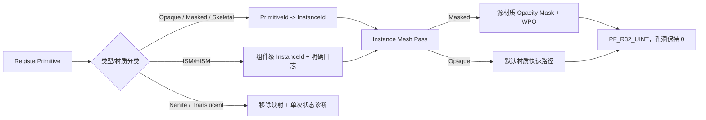
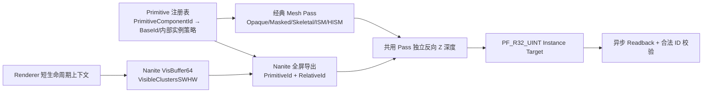
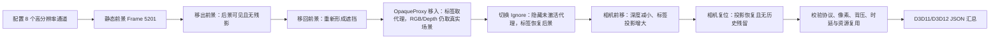
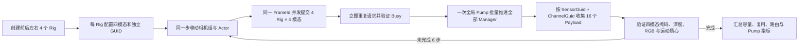
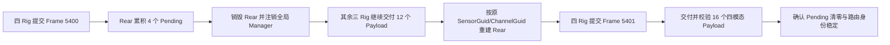
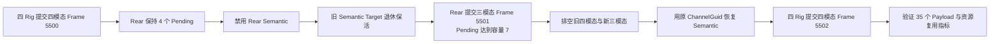

# SensorSimulation 实现路线

## 当前状态

已完成：

- [x] Semantic Channel 无后处理污染的 Global Shader。
- [x] `FImageReadbackManager::Enqueue` 与非阻塞 GPU Readback。
- [x] RGB/Semantic Payload 输出并提交给 `USimulationSubsystem`。
- [x] Semantic 标签、View Rect、Gamma 与像素格式校验。
- [x] `SensorSimulationHostEditor Win64 Development` 编译验证。
- [x] Instance 32 位 Mesh Pass、R32Uint 读回/协议/Writer，以及 D3D11/D3D12 生命周期验收。
- [x] R15 特殊对象闭环：ISM/HISM 逐内部实例 ID、D3D12 Nanite 专用导出，以及 HISM/Masked/SkeletalMesh/Translucent Ignore/OpaqueProxy 的 D3D11/D3D12 像素矩阵。

仍待完成：

- [ ] Export Worker 与 PNG/BIN/CSV Writer。
- [ ] 多个同模态传感器的完成数量追踪。
- [ ] Frame Timeout、丢帧统计与更完整的背压策略。
- [ ] 自动化 Demo Map 和运行时像素回归测试。

## Runtime 确定性调度与会话语义收口（2026-08-16，已完成）

### 为什么要这样做

确定性数据集要求相同配置产生相同时间戳和帧顺序。若采样时间继续依赖游戏 Tick、Export 满载时在游戏线程 Sleep，或者 Session 中途重新读取 CDO 与相对路径，渲染帧率、磁盘速度、启动目录和编辑器修改都会改变数据集语义。

### 当前如何做

- [x] 新增 `FSimulationScheduler`；确定性模式忽略 DeltaTime，只在 FrameAssembler 空闲且 Export 有容量时推进一个固定步。
- [x] Export 满载改为 `PauseDatasetClock` 非阻塞返回，完整帧保留在 FrameAssembler；完整帧等待 Export 时不会被超时清理。
- [x] Export Worker 使用 `FEvent` 等待任务，Enqueue/Stop 唤醒，删除两处 1ms Sleep 轮询。
- [x] `DatasetRoot` 空值和相对值统一锚定 Project/Saved，逃逸相对路径回退到 Saved/SensorSimulation，绝对路径保持支持。
- [x] `FSimulationRuntimeSettingsSnapshot` 在 Session 初始化时固定模式、步长、容量、目录、超时和 Seed；Deinitialize metadata 也读取快照。

### 验证证据

- UE 5.7.2 `SensorSimulationHostEditor Win64 Development` 编译成功。
- `Saved/Acceptance/RuntimeDeterminism/UE572/RuntimeTests.log`：7/7 Runtime 测试成功，退出码 0。
- `Saved/Acceptance/RuntimeDeterminism/UE572/ExportLifecycle.log`：Export Stop/Restart/Drain 成功，退出码 0。

### 下一步可以怎么优化

1. 增加不同游戏帧率和人为 Export 延迟下的完整 Session 哈希复现测试。
2. 把调度暂停原因、累计暂停时长和 Export Queue 高水位写入 metadata。
3. 增加命令行/任务配置覆盖层，并确保覆盖完成后再生成 Session 快照。
## R13-R14 完成记录（2026-08-02）

- 实现真正的 uint32 Instance 通道，不复用 8 位 CustomStencil。
- 增加原生 `PF_R32_UINT` 渲染、按 RowPitch 精确读回、`R32Uint/Data/Identifier` 协议校验和 `instance_u32.bin` 文件输出。
- 显式绑定捕获 View 矩阵以及 Scene/InstanceCulling 静态 Uniform，修复后处理阶段的网格绘制。
- D3D11 与 D3D12 均完成 `0x01020304` 端到端生命周期及 Writer 验收。
- R15 Phase A 已完成：Masked Instance Capture 执行源材质 Opacity Mask/WPO，而不是绘制实心代理。
- 当时 Nanite 与 Translucent 采用显式排除，ISM/HISM 采用组件级身份；这些限制已由下方 Phase B 的当前实现更新。

## R15 特殊渲染对象（Phase A，2026-08-04）

### 为什么要这样做

普通 Opaque Mesh 可以用默认材质重绘完整轮廓，但 Masked、Nanite、Translucent 和 ISM/HISM 的可见性来源不同。如果继续把它们当普通 Mesh，Masked 孔洞会被错误填满，Nanite/Translucent 会静默缺失，ISM/HISM 则容易被误解为每个内部实例都有独立 ID。因此 Renderer 必须同时解决“能精确支持的对象”和“当前不能精确支持时如何明确失败”。

### 如何做



- `FInstanceCaptureVS/PS::ShouldCompilePermutation` 为 Masked 业务材质生成所需排列。
- Masked Draw 保留源 `MaterialRenderProxy/FMaterial`，VS 保留 WPO，PS 使用 UE 官方材质覆盖率/裁剪路径执行 Opacity Mask。
- Opaque Draw 继续使用默认材质，避免无意义的业务材质排列膨胀。
- Registry 在游戏线程注册时识别 Nanite、Translucent 与 ISM/HISM，并缓存诊断状态，热更新不会重复刷同一条日志。
- SkeletalMesh 沿动态 Mesh 可见集进入现有 Pass；普通非 Nanite SkeletalMesh 使用组件级对象 ID。

### 当前支持矩阵

| 对象 | Instance 行为 | 当前结论 |
|---|---|---|
| Opaque StaticMesh | 默认材质重绘 | 支持 |
| Masked StaticMesh/foliage | 源材质裁剪并保留 WPO | 支持（经典非 Nanite 路径） |
| SkeletalMesh | 动态 Mesh 路径、组件级 ID | 支持（非 Nanite） |
| ISM/HISM | 全部内部实例共享组件 ID | 显式支持组件级语义 |
| Nanite | 不进入经典 Mesh Pass | 显式拒绝 |
| Translucent | 尚无唯一前景标签规则 | 显式拒绝，保持背景 |

### 下一步可以怎么优化

- Phase B 为 ISM/HISM 增加 per-instance GPU 数据源，使每个内部实例写独立 uint32 ID。
- 为 Nanite 增加专用可编程 Raster/Material Export 路径，不能用经典 MeshBatch 假装支持。
- 先确定 Translucent 的产品规则（忽略、最前表面、Opacity 阈值或多层标签），再实现对应渲染路径。
- 增加 Masked foliage、SkeletalMesh 动画、Nanite 拒绝、Translucent 拒绝和 ISM/HISM 组件级行为的 D3D11/D3D12 像素回归。

## R15 阶段 B 实施审计（2026-08-11，已完成）

### 为什么要这样做

汽车和机器人场景会大量使用 ISM/HISM、Nanite 车身或环境资产以及玻璃等半透明材质。若这些对象只写组件级 ID、静默缺失或采用未定义的透明规则，遮挡关系、实例级跟踪和训练标签都会失真。因此 R15 必须以“像素结果可证明正确”为完成标准，不能只以 Shader 能编译为准。

### 当前如何做



- [x] 语义注册表为 Actor 本体及其 ISM/HISM 内部实例预留连续的 32 位 ID 区间，并把全部合法值交给 Payload 校验。
- [x] Instance 注册绑定已携带连续区间起点、是否使用内部实例编号及实例数量；Shader 已能计算 BaseInstanceId + RelativeId。
- [x] 半透明产品策略拆为逐对象可选的 `Ignore` 与 `OpaqueProxy`：`Ignore` 不写标签深度并透出后方对象；`OpaqueProxy` 使用同 Actor 的不透明代理写玻璃自身标签，代理从 RGB/Depth 隔离。
- [x] 半透明对象继续显式诊断；Nanite 不再进入经典 MeshBatch，而是由专用 VisBuffer 导出路径处理。
- [x] UE 5.7.2 Renderer 在 `AddPostProcessingPasses` 调用栈内提供短生命周期扩展上下文，插件可借用当前 `FInstanceCullingManager`，但不得跨帧缓存指针。
- [x] Instance Pass 已由 Dummy Uniform 的 `AddDrawDynamicMeshPass` 改为 `AddSimpleMeshPass`，复用正式 GPU Scene 实例裁剪和 Primitive-ID 流。
- [x] Shader 同时覆盖 `USE_INSTANCING` 与 `USE_INSTANCE_CULLING`；ISM/HISM 的每个内部实例写 `BaseInstanceId + RelativeId`，两个实例的强制像素断言已在 D3D11/D3D12 通过。
- [x] Nanite 专用路径在 `NaniteRasterResults` 存活期读取 `VisBuffer64` 与 `VisibleClustersSWHW`，由 GPU Scene `PrimitiveId/RelativeId` 映射稳定 32 位 InstanceId，并与经典 Mesh Pass 共用独立反向 Z 深度。
- [x] 自包含 D3D12 回归在测试中把 Engine Cube 临时构建为 Nanite；回读同时强制断言 Nanite ID 与两个 ISM 内部实例 ID。
- [x] `SensorSimulation.Rendering.SpecialObjects.CrossRHI` 已覆盖独立 HISM、UV.x Masked 孔洞、非 Nanite SkeletalMesh，以及 Translucent `Ignore` 后景可见和 `OpaqueProxy` 前景遮挡；D3D11 与 D3D12 均通过。

### 验证证据

- UE 5.7.2 `SensorSimulationHostEditor Win64 Development`：31/31 Renderer/插件增量动作通过；断言升级后 4/4 测试模块增量动作通过。
- D3D12：`Saved/Acceptance/R15_SpecialObjects/UE572_OfficialRenderer/D3D12_ISM_RequiredAssertion.log`，观察到 `16909061:20` 与 `16909062:19`，用例成功。
- D3D11：`Saved/Acceptance/R15_SpecialObjects/UE572_OfficialRenderer/D3D11_ISM_RequiredAssertion.log`，观察到 `16909061:20` 与 `16909062:20`，用例成功。
- D3D12 Nanite：`Saved/Logs/R15_NanitePixelDiscardFix_DX12.log`，观察到 Nanite `16909312:20`、ISM `16909061:20` 和 `16909062:20`，用例成功。
- 最终 D3D12 特殊对象矩阵：`Saved/Acceptance/R15_SpecialObjects/UE572_CrossRHI_Matrix/D3D12.log`，用例成功；Masked 前景/孔洞后景为 `16916481:280`、`16920576:216`，SkeletalMesh 为 `16924672:8`，Translucent 后景为 `16932864:236`，HISM 内部实例为 `16912385:98`、`16912386:104`。
- 最终 D3D11 特殊对象矩阵：`Saved/Acceptance/R15_SpecialObjects/UE572_CrossRHI_Matrix/D3D11.log`，用例成功，全部 ID 与像素计数和 D3D12 一致；Translucent 前景 ID `16928768` 在两种 RHI 中均不存在。
- 半透明双策略最终矩阵：`Saved/Acceptance/R15_SpecialObjects/UE572_TranslucentPolicies/D3D12.log` 与 `D3D11.log` 均成功；`Ignore` 后景 `16932864:236`，`OpaqueProxy` 代理 `16936960:220`，其被遮挡后景 `16941056` 不存在。
- Nanite Shader 的每条 `discard` 路径会先初始化颜色与深度输出，与 UE 官方 HitProxy 导出契约一致；失败探针证明省略该初始化会使整数目标回读为全背景。
- 失败探针 `D3D12_ISM_FormalCulling_Run2.log` 证明只接入正式裁剪仍不足；随后补齐 `USE_INSTANCE_CULLING` Shader 分支，形成可复现的根因—修复—回归证据链。

### 下一步怎么做

1. [x] 已在 Renderer 后处理调用栈增加最小只读上下文，并用正式 `FInstanceCullingManager` 闭环 ISM/HISM 逐内部实例 ID。
2. [x] 已在 `NaniteRasterResults` 存活期增加只读导出 Pass，解码 VisBuffer 并映射稳定 InstanceId；D3D12 真实像素断言通过。
3. [x] 已补齐独立 HISM、Masked foliage、SkeletalMesh 与半透明 `Ignore`/`OpaqueProxy` 用例，形成 D3D11（经典路径）与 D3D12（经典 + Nanite）特殊对象像素矩阵，R15 已完成。
4. [x] 已将引擎改动维护为可重复应用补丁，并增加 UE 版本与 Renderer API 编译守卫。

## UE Renderer 补丁化阶段（2026-08-14，已完成）

### 为什么要这样做

R15 的 ISM/HISM 与 Nanite 路径需要 `FInstanceCullingManager` 和 `NaniteRasterResults`，但它们只在 Renderer 后处理栈内短暂有效。手工修改引擎既无法随项目迁移，也无法阻止未来 UE API 漂移，因此必须把“引擎改了什么、支持哪个版本、如何判断已应用”变成可执行契约。

### 当前如何做

- [x] 以 Epic 官方 `5.7.2-release` 为基线，将改动收敛为 `SensorSimulationRendererContext.patch`，只涉及 `PostProcessing.h/.cpp`。
- [x] 补丁使用 `TGuardValue` 在 `AddPostProcessingPasses` 调用栈内发布并恢复上下文；插件不拥有且不缓存其中指针。
- [x] `manifest.json` 记录 UE `5.7.2`、Compatible Changelist `47537391`、两个修改文件和两个借用成员。
- [x] `check_renderer_patch.ps1` 校验引擎版本、上下文类型、两个成员、Getter 声明/定义和作用域 Guard，并输出机器可读 JSON。
- [x] `RendererCompatibility.h` 对 UE 主版本、次版本和补丁版本实施编译期硬守卫，并通过显式成员类型赋值检查定制 API。
- [x] `InstanceCaptureViewExtension.cpp` 不再直接调用定制 Getter，而是统一经过兼容层。

### 验证证据

- `Saved/Acceptance/RendererPatch/UE572/RendererPatchCheck.json`：版本 `5.7.2`、PatchState `Applied`、MissingFeatures 为空。
- `git apply --reverse --check Tools/EnginePatches/UE5.7.2/SensorSimulationRendererContext.patch` 成功，说明当前引擎内容与补丁结果一致。
- UE 5.7.2 `SensorSimulationHostEditor Win64 Development` 增量构建成功，四个动作全部完成。

### 下一步可以怎么优化

1. [x] 已增加统一前置构建入口与手动自托管 CI，在调用 UBT 前检查 Renderer 补丁。
2. UE 升级时从对应官方 tag 重新生成补丁，评审 Renderer 生命周期变化后再更新版本守卫。
3. 补丁重放后必须重跑 D3D11/D3D12 特殊对象和四模态输出矩阵，不能只以编译成功作为兼容依据。

## Renderer 前置构建门禁阶段（2026-08-14，已完成）

### 为什么要这样做

只提供独立检查脚本仍依赖开发者记得先运行它，无法保证本地构建和 CI 顺序一致。另一方面，UE 源码与定制引擎位于受控构建机，自动执行外部 PR 会扩大安全边界，因此第一阶段 CI 必须采用手动触发和专用 Runner。

### 当前如何做

- [x] `Tools/build_with_renderer_preflight.ps1` 固定执行“Renderer Patch Check → UBT Build → JSON Summary”。
- [x] 支持 `UE_ENGINE_ROOT`、`-EngineRoot`、目标和配置参数；`-SkipBuild` 可只验证构建机镜像。
- [x] 前置失败、构建输入失败和 UBT 失败分别写入 `FailureStage`，进程退出码保持失败。
- [x] `.github/workflows/renderer-preflight.yml` 使用 `workflow_dispatch`，仅匹配 `[self-hosted, Windows, X64, ue-5.7.2]`。
- [x] 工作流权限只有 `contents: read`，Checkout 设置 `persist-credentials: false`，依赖固定到官方 v7.0.1 提交。
- [x] 自动 PR/push 触发未启用，避免未审查代码在持有 Epic 引擎源码的自托管机器上执行。

### 验证证据

- `Saved/Acceptance/RendererPreflight/UE572/RendererPreflightSummary.json`：前置检查通过、构建已请求、BuildExitCode 为 0、Passed 为 true。
- `Saved/Acceptance/RendererPreflight/FaultInjection/RendererPreflightSummary.json`：不存在引擎路径时 PreflightPassed 为 false、FailureStage 为 RendererPatchCheck，观测退出码为 1。
- UBT 日志显示 `Target is up to date` 和 `Result: Succeeded`。
- 工作流 YAML 已完成本地解析，`git diff --check` 通过。

### 下一步可以怎么优化

1. 在隔离 Windows 构建机安装最新 GitHub Actions Runner，并添加 `ue-5.7.2` 自定义标签。
2. 首次手动运行工作流，验证 Epic/GitHub 权限、磁盘容量、超时和 Artifact 保留策略。
3. 手动门禁稳定后，把 Renderer 输出矩阵作为后续 Job；开放 PR 自动触发前必须隔离外部贡献者代码和长期凭据。

## OpaqueProxy 产品化校验阶段（2026-08-14，已完成）

### 为什么要这样做

运行时拒绝只能在开始采集后发现问题；汽车玻璃代理若选错 Actor、仍使用透明材质或严重偏离玻璃，会生成边界错误但外观看似正常的标签。因此配置问题必须在编辑器保存、人工验证或提交资产时提前暴露。

### 当前如何做

- [x] `USemanticObjectComponent::IsDataValid` 已接入 UE 5.7.2 Data Validation。
- [x] 缺少 `OpaqueLabelProxy`、代理不属于同一 Actor、代理使用 Translucent 材质均返回 Invalid。
- [x] 未注册、缺少透明源和包围盒偏差过大返回 Warning，不因合理的近似代理阻断资产提交。
- [x] `OpaqueProxyBoundsTolerance` 默认 0.2，比较代理与同 Actor 半透明源的中心和尺寸最大相对偏差。
- [x] 独立自动化覆盖有效、缺失、跨 Actor、透明代理、明显错位和未注册状态。

### 验证证据

- UE 5.7.2 UHT 与 `SensorSimulationHostEditor Win64 Development` 编译通过。
- `Saved/Acceptance/OpaqueProxyValidation/UE572/D3D12.log`：`SensorSimulation.Rendering.OpaqueProxy.DataValidation` 成功，退出码为 0。

### 运行时隔离补充（已完成）

- [x] `ApplyCaptureConfiguration()` 为蓝图和 C++ 提供显式热应用入口。
- [x] 代理隔离状态不再随 `Ignore` 策略释放，配置代理在两种策略下都不会进入主视口、RGB 或 Depth。
- [x] 四模态两帧回归验证 `OpaqueProxy → Ignore` 后 Semantic/Instance 从代理切换到后景，而 RGB/Depth 保持不受代理影响。
- [x] D3D12：`Saved/Acceptance/OpaqueProxyIsolation/UE572/D3D12.log`，用例成功。
- [x] D3D11：`Saved/Acceptance/OpaqueProxyIsolation/UE572/D3D11.log`，用例成功。

### 下一步可以怎么优化

1. 增加代理三角面数预算和自动生成低精度代理的编辑器工具。
2. 配置隔离的 `ue-5.7.2` 自托管 Runner，并首次手动运行 Renderer 门禁工作流。

## Renderer 输出矩阵阶段 1（2026-08-14，已完成）

### 为什么要这样做

R15 证明了特殊对象路径能够输出正确标签，但不能代替 RGB、Semantic、Depth、Instance 在不同尺寸下的协议验收。奇数 ViewRect、RowPitch、Gamma 或 RHI 通道顺序错误都可能让单一分辨率测试通过、正式数据集失真，因此需要四模态共用的真实 GPU 基线。

### 当前如何做

- [x] 新增 `SensorSimulation.Rendering.OutputMatrix.AllModalities`，一个 Camera Rig 同时创建四种模态 × 两种分辨率，共 8 条稳定 ChannelGuid 通道。
- [x] 分辨率覆盖 32×24 偶数尺寸和 17×11 奇数尺寸，验证有效 ViewRect 与池化纹理尺寸不混淆。
- [x] 通用断言覆盖 ImageSize、ViewRect、PixelFormat、ColorSpace、ValueUnit、BytesPerPixel、RowStride 和紧密字节数。
- [x] RGB 要求存在有效颜色且 Alpha 规范化为 255；Semantic 只允许背景 0 和类别 17，G/B 为 0、A 为 255；Depth 要求 Float32、米制且为有限值；Instance 要求背景 0 和完整 `0x01030000`。
- [x] 新增 `Tools/run_renderer_output_matrix.ps1`，顺序运行 D3D11/D3D12，并输出固定 Schema 的 JSON 汇总。

### 验证证据

- UE 5.7.2 `SensorSimulationHostEditor Win64 Development` 增量编译通过。
- `Saved/Acceptance/RendererOutputMatrix/UE572/D3D11.log`：测试成功，17×11 与 32×24 均观察到完整 InstanceId `16973824`。
- `Saved/Acceptance/RendererOutputMatrix/UE572/D3D12.log`：测试成功，四模态全部协议和像素断言通过。
- `Saved/Acceptance/RendererOutputMatrix/UE572/RendererOutputMatrixSummary.json`：`Passed=true`，D3D11/D3D12 进程退出码均为 0。

### 下一步可以怎么优化

1. [x] 640×480、1280×720 已由阶段 2 的独立慢速矩阵覆盖。
2. [x] 物体运动、相机前移/复位、遮挡、无残影及 OpaqueProxy/Ignore 像素切换已由阶段 2 覆盖。
3. [x] Readback 延迟、Accepted/Busy/Rejected 与资源复用指标已写入阶段 2 JSON；四方向多相机基础并发已由阶段 3 完成，Pending 状态下销毁/重建压力仍待后续。

## Renderer 输出矩阵阶段 2（2026-08-15，已完成）

### 为什么要这样做

阶段 1 证明了小尺寸静态协议正确，但无法发现正式分辨率、多 SceneCapture、运动变换和策略热切换中的跨 View 状态错误。阶段 2 使用标准/高清输出和连续场景状态，让同一帧的 RGB、Semantic、Depth、Instance 同时接受像素级与传输级验收。

### 当前如何做

- [x] 新增 `SensorSimulation.Rendering.OutputMatrix.Phase2.HighResolutionMotionOcclusion`，覆盖 4 种模态 × 640×480/1280×720，共 8 条 ChannelGuid。
- [x] 连续采集 7 个 SceneCase：前景静态、Actor 移出且无残影、移回遮挡、OpaqueProxy 移入、切换 Ignore、相机前移 1 米、相机复位。
- [x] 每次 Actor/代理/相机状态变化与正式采集分离，并留出 12 帧 GPU Scene/SceneProxy 稳定窗口；Instance 快照设置 CameraCut，避免旧可见性历史污染标签。
- [x] Instance Mesh Pass 显式绑定当前 `FViewUniformShaderParameters`，Shader 使用 `ResolvedView.TranslatedWorldToClip`，消除 D3D12 下 640×480 与 1280×720 投影矩阵串用。
- [x] 未激活的 OpaqueProxy 在 Instance View 中隐藏，避免无 ID 的代理遮挡 Ignore 策略后的真实对象；RGB/Depth 始终隔离标签代理。
- [x] GPU Readback 在原始 RHI Copy 前显式转换源纹理为 `CopySrc`，并保持 Readback Fence/Poll 异步链路与完整资源复用。
- [x] 验证 Accepted=7、Busy=1、Rejected=1、Enqueued/Completed/Delivered=56、PeakPending=Capacity=8，以及每个 ChannelGuid 的时延和复用指标。
- [x] 新增 `Tools/run_renderer_output_matrix_phase2.ps1`，顺序执行 D3D11/D3D12，禁用无关 CEF 并生成固定 Schema JSON。

### 逻辑流程



### 验证证据

- UE 5.7.2 `SensorSimulationHostEditor Win64 Development` 增量编译通过。
- `Saved/Acceptance/RendererOutputMatrixPhase2/UE572/D3D11.log`：用例成功，进程退出码 0。
- `Saved/Acceptance/RendererOutputMatrixPhase2/UE572/D3D12.log`：用例成功，进程退出码 0。
- `Saved/Acceptance/RendererOutputMatrixPhase2/UE572/RendererOutputMatrixPhase2Summary.json`：`Passed=true`。
- D3D11：Accepted=7、Enqueued/Completed/Delivered=56、Created=8、Reused=48、AvgGpu=29.304 ms、MaxGpu=42.441 ms、AvgDelivery=42.566 ms、MaxDelivery=48.186 ms。
- D3D12：Accepted=7、Enqueued/Completed/Delivered=56、Created=8、Reused=48、AvgGpu=26.101 ms、MaxGpu=35.989 ms、AvgDelivery=48.576 ms、MaxDelivery=61.203 ms。

### 下一步可以怎么优化

1. [x] 阶段 3 已完成四个 Camera Rig 同时提交、ChannelGuid 路由、Busy 和全局 Pump 验证；阶段 4 又完成 Pending 状态下的单 Rig 销毁与同身份重建。
2. 增加模块卸载、RHI 设备重建和关卡切换期间仍有 Pending Readback 的生命周期矩阵。
3. [x] 阶段 3 已完成相机组平移与 Actor 同时连续运动；相机旋转、独立抖动及基于 Scene/GPU Scene Fence 的确定性准入仍可继续扩展。

## Renderer 输出矩阵阶段 3（2026-08-15，已完成）

### 为什么要这样做

阶段 2 分别证明了 Actor 和单个 Camera Rig 改变位姿后的输出正确，但没有覆盖二者在连续采样轨迹中同时运动，也没有证明前、后、左、右四个 Rig 同一 FrameId 并发提交时仍能保持传感器身份、通道路由、背压和全局 Pump 隔离。阶段 3 把这两个风险合并为一次真实 GPU 验收。

### 当前如何做

- [x] 新增 `SensorSimulation.Rendering.OutputMatrix.Phase3.FourRigConcurrentContinuousMotion`。
- [x] 创建 Front、Rear、Left、Right 四个 Camera Rig；每个 Rig 启用 RGB、Semantic、Depth、Instance，共 16 条全局唯一 ChannelGuid。
- [x] 连续执行 6 个 0.05 秒逻辑采样步；相机组约以 6.4 m/s、Actor 约以 6.7 m/s 使用不同轨迹同时移动，首帧后不再插入 Scene 稳定窗口。
- [x] 每个 FrameId 先同时向四个 Rig 提交 16 个通道，再立即对每个 Rig 重复提交；首次请求必须 Accepted，重复请求必须 Busy，且不能产生部分通道半帧。
- [x] Payload 按 SensorGuid 定位 Rig、按 ChannelGuid 定位模态；四 Rig 的 16 条通道逐帧唯一且不能串台。
- [x] Semantic 与 Instance 前景掩码要求逐像素完全一致；Depth/Semantic 全图 IoU 要求至少 0.98，RGB/Semantic 在保留正常颜色抗锯齿的前提下要求至少 0.88，并验证 RGB/Depth 在标签质心处有效。
- [x] 使用 `FImageReadbackGlobalPumpStats` 证明任一 Manager 的一次 Poll 只提交一条全局 Pump 命令，并在同一弱引用快照中推进全部活跃 Manager。
- [x] 验证每个 Manager 容量为 4、创建 4 个 Readback 资源并在后续 5 帧复用 20 次；全局合计 Created=16、Reused=80。

### 逻辑流程



### 验证证据

- UE 5.7.2 `SensorSimulationHostEditor Win64 Development` 增量编译通过。
- `Saved/Acceptance/RendererOutputMatrixPhase3/UE572/D3D11.log`：用例成功，进程退出码 0。
- `Saved/Acceptance/RendererOutputMatrixPhase3/UE572/D3D12.log`：用例成功，进程退出码 0。
- 两个 RHI 均为 Rigs=4、Frames=6、Accepted=24、Busy=24、Enqueued/Completed/Delivered=96、Created=16、Reused=80。
- 两个 RHI 均记录 PumpCommands=15、PumpedManagers=120、PeakManagersPerPump=8；峰值 8 来自编辑器世界和 PIE 世界各四个已注册 Manager，证明单条全局命令会批量遍历完整活跃快照。

### 下一步可以怎么优化

1. [x] 阶段 4 已完成四 Rig 中单个 Rig 在仍有 Pending Readback 时的销毁与同身份重建；禁用与重新启用可并入后续热更新压力矩阵。
2. 增加相机组旋转、各 Rig 独立抖动、车辆转弯和骨骼 Actor 高速动画，使联合运动覆盖更复杂的 View/SceneProxy 更新。
3. 将 320×240 正确性矩阵扩展到目标交付分辨率和长时间连续采集，记录显存、GPU 时延、Busy 比例与数据集吞吐。

## Renderer 输出矩阵阶段 4（2026-08-15，已完成）

### 为什么要这样做

阶段 3 证明了四个方向的 Camera Rig 可以同时提交并由全局 Pump 批量推进，但稳定运行还要求某一台相机在 GPU Copy 尚未完成时可以独立退出，不能让排队的渲染命令访问已销毁 Manager，也不能阻塞其他相机。车辆或机器人运行时更换、重启或动态装卸某个方向的相机时，还必须恢复原来的 SensorGuid/ChannelGuid 路由身份。

### 当前如何做

- [x] 新增 `SensorSimulation.Rendering.OutputMatrix.Phase4.PendingRigDestroyRebuild`，创建前、后、左、右四个 Rig，每个 Rig 启用 RGB、Semantic、Depth、Instance。
- [x] Frame 5400 同时向四个 Rig 提交；在任何 Poll 之前确认 Rear Manager 已有 4 个 Pending/Enqueued Readback，然后立即销毁 Rear 组件和 Actor。
- [x] `UCameraRigComponent::OnUnregister` 释放自身 Manager；Manager 从 Renderer 全局弱引用注册表注销，而已排队渲染命令通过线程安全共享状态完成安全清理。
- [x] 销毁 Rear 后继续轮询 Front、Left、Right，要求原帧的 12 个 Payload 全部完成，证明单台退出不会拖住其余 Manager。
- [x] 使用相同 SensorGuid、ChannelGuid、相机名和四模态配置重建 Rear；要求全局 Manager 数恢复，且旧路由身份不漂移。
- [x] Frame 5401 再次同时提交四 Rig，要求 16 个 Payload 按 SensorGuid + ChannelGuid 唯一路由，并验证 Semantic、Instance 中心标签与 Depth 米制值。
- [x] 旧 Rear 的 4 个 Pending Payload 明确按“消费者已销毁，安全放弃”处理；保留的三台和重建的 Rear 共交付 28 个 Payload，所有在用 Manager 最终 Pending=0。

### 逻辑流程



### 验证证据

- UE 5.7.2 `SensorSimulationHostEditor Win64 Development` 增量编译通过。
- `Saved/Acceptance/RendererOutputMatrixPhase4/UE572/D3D11.log`：用例成功，进程退出码 0。
- `Saved/Acceptance/RendererOutputMatrixPhase4/UE572/D3D12.log`：用例成功，进程退出码 0。
- 两个 RHI 指标一致：Accepted=8、OldRearPending=4、OldRearEnqueued=4、Delivered=28、RegisteredBefore=8、RegisteredAfterDestroy=7、RegisteredAfterRebuild=8。

### 下一步可以怎么优化

1. [x] 阶段 5 已完成单 Rig 通道禁用/重新启用，并覆盖旧 Target 仍有关联 Pending Readback 的情况；关卡切换和 PIE 退出组合压力仍待后续。
2. 在可控测试环境中覆盖 Renderer 模块卸载与 RHI 设备重建，验证全局注册表和共享 RHI 资源不会泄漏。
3. 增加相机旋转、独立抖动、目标交付分辨率及长时间采集，把生命周期正确性与性能退化联合验收。

## Renderer 输出矩阵阶段 5（2026-08-15，已完成）

### 为什么要这样做

运行中的汽车或机器人可能临时关闭某个数据模态以降低带宽，也可能在配置热更新后重新启用它。如果直接释放仍被 GPU Copy 引用的旧 Target，会产生悬空资源；如果为了关闭一个通道重建整个 Rig，又会破坏其他通道的连续性、资源复用和稳定 ChannelGuid。因此需要在多 Rig 并发背景下单独验证通道级生命周期。

### 当前如何做

- [x] 新增 `SensorSimulation.Rendering.OutputMatrix.Phase5.ChannelDisableRestore`；前、后、左、右四个 Rig 均配置 RGB、Semantic、Depth、Instance。
- [x] 四 Rig 提交 Frame 5500 后，在 Rear 的四个 Readback 仍 Pending 时禁用 Semantic 并调用 `ApplyConfiguration()`。
- [x] Rear Readback 容量设为 7；旧四任务在途时继续提交只含 RGB/Depth/Instance 的 Frame 5501，要求三任务全部 Accepted，禁止出现 Busy 或半帧。
- [x] 禁用期间旧 Semantic Payload 仍必须安全完成；Frame 5501 不得产生 Semantic Payload。
- [x] 资源指标要求只销毁/退休一个 Semantic Capture/Target，其他三个 Capture 与 Target 组在禁用和恢复两次配置变更中累计复用各 6 次。
- [x] Pending 排空后重新启用原配置项，保持原 Semantic ChannelGuid，创建一个替代 Capture/Target，且不更换 Readback Manager 或改变全局注册数。
- [x] Frame 5502 再次由四 Rig 完整提交四模态，验证恢复后的 Semantic、Instance、Depth 像素和 SensorGuid + ChannelGuid 路由。

### 逻辑流程



### 验证证据

- UE 5.7.2 `SensorSimulationHostEditor Win64 Development` 增量编译通过。
- `Saved/Acceptance/RendererOutputMatrixPhase5/UE572/D3D11.log`：用例成功，退出码 0。
- `Saved/Acceptance/RendererOutputMatrixPhase5/UE572/D3D12.log`：用例成功，退出码 0。
- 双 RHI 指标一致：Accepted=9、Delivered/Enqueued=35、RearSemanticDelivered=2、RearOtherDelivered=3、RegisteredManagers=8、ReusedCaptures=6、ReusedTargets=6、DestroyedCaptures=1、DestroyedTargets=1。

### 下一步可以怎么优化

1. 增加两台或四台 Rig 在 Pending 状态下同时退出，验证全局 Pump 快照批量移除和剩余 Manager 公平性。
2. 增加 Pending 状态下的关卡切换与 PIE 退出组合，验证 World 清理顺序和跨 World 注册隔离。
3. 最后覆盖 Renderer 模块卸载及 RHI 设备重建；这两项需要独立进程或受控引擎测试环境。

## Render Pipeline Owner

### 1. [x] 为 Semantic Channel 创建无后处理污染的 Global Shader

#### 为什么要这样做

Semantic 图像保存的是离散类别编号，而不是用于显示的颜色。TAA/FXAA、Bloom、Motion Blur、曝光和 Tonemap 都可能混合相邻像素或改变数值，使一个合法标签变成不存在的中间值。因此 Semantic Channel 必须绕开颜色后处理，并逐像素输出确定的整数标签。

#### 如何做

1. `USemanticObjectComponent` 把 `SemanticId` 限制到 Custom Stencil 可表达的 `0..255`；`0` 保留为背景。
2. Semantic Scene Capture 使用线性 `RGBA8` Render Target，并关闭 Anti-Aliasing、Bloom、Depth of Field、Eye Adaptation 和 Motion Blur。
3. `FSemanticCaptureViewExtension` 只接管 Semantic 专用 Scene Capture。
4. `FSemanticCapturePS` 使用整数像素坐标读取 Custom Stencil，不读取 Scene Color，不做双线性采样。
5. Shader 输出协议固定为 `R=SemanticId, G=0, B=0, A=255`，并覆盖 Tonemap 后的颜色结果。
6. 工程使用 `r.CustomDepth=3`，即 Custom Depth with Stencil。

对应代码：

- `Shaders/Private/SemanticCapture.usf`
- `SimulationRenderer/Private/SemanticCaptureViewExtension.*`
- `SimulationRenderer/Private/SimulationRenderer.cpp`
- `SimulationRenderer/Private/CameraRigComponent.cpp`
- `SimulationRuntime/Private/SemanticObjectComponent.cpp`

#### 下一步可以怎么优化

- 用真正的整数 Render Target 扩展 Instance Channel，避免 32 位实例编号被 RGBA8 限制。
- 增加离屏自动化测试，逐像素比较预期标签，并覆盖物体运动、遮挡和边缘情况。
- 用显式的捕获标识替代对 Scene Capture Source 的约定，让 Semantic View 的识别更清晰。

> 本项本轮只补充文档，没有修改已经完成的 Global Shader 代码。

### 2. [x] 实现 `FImageReadbackManager::Enqueue`

#### 为什么要这样做

每帧调用 `ReadPixels()` 会让游戏线程等待渲染线程和 GPU，破坏实时性。异步 GPU Readback 先把纹理复制到 staging texture，再通过 fence 判断 GPU 是否完成，CPU 只在就绪后复制数据，因此不会在正常轮询路径中主动等待 GPU。

#### 如何做

1. 游戏线程先验证 Render Target、Payload 类型、尺寸、Gamma 和像素格式。
2. 使用原子计数预留有限队列容量；队列满时拒绝请求并记录日志，防止内存无上限增长。
3. 通过 `ENQUEUE_RENDER_COMMAND` 在渲染线程创建 `FRHIGPUTextureReadback`。
4. 对 `[0, 0, Width, Height]` 完整 View Rect 调用 `EnqueueCopy`。
5. `PollCompleted` 只排队一次非阻塞 fence 检查；`IsReady()` 为真后才执行 `Lock`。
6. 依据返回的 `RowPitchInPixels` 逐行复制，忽略 staging texture 的行尾 padding。
7. 若底层格式为 `PF_B8G8R8A8`，复制时交换 R/B，最终 `FImagePayload::Bytes` 始终使用紧密排列的规范 RGBA8。
8. CPU Payload 拥有自己的 `TArray<uint8>`，解锁 staging texture 后数据仍然有效。
9. 共享状态使用线程安全引用计数，保证排队的渲染命令不会访问已经销毁的 Manager。

对应代码：

- `SimulationRenderer/Public/ImageReadbackManager.h`
- `SimulationRenderer/Private/ImageReadbackManager.cpp`

#### 下一步可以怎么优化

- 用统一的渲染线程 ticker 或单一 pump 命令代替每次游戏线程轮询都排队一个 pump。
- 建立 `FRHIGPUTextureReadback` 对象池，减少高频采集中的 staging 资源创建。
- 增加按通道统计的队列深度、GPU 延迟、拒绝次数和读回失败次数。
- 为 Depth、Instance 增加独立的格式转换器，而不是把 Manager 限定在 RGBA8。

### 3. [x] 输出 RGB/Semantic Payload 并提交给 Subsystem

#### 为什么要这样做

Renderer 模块只应负责捕获和读回，不能反向依赖 Runtime Subsystem，否则会形成 `SimulationRuntime -> SimulationRenderer -> SimulationRuntime` 的循环依赖。需要一个位于 Runtime 模块的 Adapter，把渲染结果交给帧聚合逻辑。

#### 如何做

1. `UCameraRigComponent::SubmitCapture` 根据请求中的模态位，只处理启用的 RGB/Semantic 通道。
2. 每个通道先调用 `CaptureScene()`，再排队 `EnqueueCopy`；渲染命令顺序保证读到本次捕获结果，而不是上一帧。
3. Camera Rig 暴露 `PollCompletedImage` 和 `GetEnabledPayloadTypes`，但不引用 Runtime。
4. 新增 `USimCameraSensorComponent` 作为 Runtime Adapter：
   - 自动查找同一 Actor 上的 `UCameraRigComponent`；
   - 把 Subsystem 的 `FCaptureRequest` 转发给 Camera Rig；
   - 每 Tick 非阻塞清空完成队列；
   - 使用移动语义调用 `USimulationSubsystem::SubmitImage`。
5. `USimSensorComponentBase::GetPayloadTypes` 让 Camera 返回 RGB/Semantic、LiDAR 返回 LiDAR。
6. Subsystem 用真实传感器能力计算整帧 `ExpectedPayloads`，不再把所有传感器都误判为 LiDAR。

运行时使用要求：

- Camera Actor 上同时添加 `UCameraRigComponent` 与 `USimCameraSensorComponent`。
- Camera Rig 的 Channels 中启用 RGB 和/或 Semantic。
- Adapter 默认自动关联同一 Actor 上的 Camera Rig，也可以在 Details 中显式指定。
- 只有通过 Runtime Adapter 发起的捕获才会进入同步 Frame/Subsystem 管线；编辑器调试按钮仍是独立人工检查入口。

对应代码：

- `SimulationRenderer/Public/CameraRigComponent.h`
- `SimulationRenderer/Private/CameraRigComponent.cpp`
- `SimulationRuntime/Public/SimCameraSensorComponent.h`
- `SimulationRuntime/Private/SimCameraSensorComponent.cpp`
- `SimulationRuntime/Public/SimSensorComponentBase.h`
- `SimulationRuntime/Public/SimLidarSensorComponent.h`
- `SimulationRuntime/Private/SimulationSubsystem.cpp`

#### 下一步可以怎么优化

- [x] FrameAssembler 已按稳定 `SensorGuid + ChannelGuid` 记录逐图像通道完成状态；同名传感器以及同一传感器的同模态多配置互不覆盖。
- Adapter 可增加采样频率调度，避免所有相机完全依赖 Subsystem 的全局固定步长。
- [x] `RequestCapture` 已返回 `Accepted/Busy/Rejected`；队列 Busy 或资源 Rejected 会立即反馈给 FrameAssembler 并终止帧。
- [x] 完成 Payload 已送入有界 Export Worker 队列，文件编码不占用游戏线程。
- 下一步可增加 Pending Frame 容量上限，并将终态历史容量与拒绝策略参数化。

### 3.1 [x] 图像通道寻址升级为 ChannelGuid

#### 为什么要这样做

`ChannelType` 只能说明图像是 RGB、Semantic、Depth 或 Instance，不能唯一表示某条配置。若同一类型出现两次，按类型查询会拿到第一张 RenderTarget，按模态完成计数会提前结束帧，文件也可能覆盖。

#### 如何做

- `FCaptureRequest::ExpectedImageChannels` 显式携带每条 `ChannelGuid + PayloadType`。
- Camera Rig 允许同一 `ChannelType` 多配置，资源创建、热更新复用、RenderTarget 和像素格式查询以 ChannelGuid 寻址。
- Readback 把 ChannelGuid 固化到任务键和 `FImagePayload`；指标按 `SensorGuid + ChannelGuid` 隔离。
- FrameAssembler 分别等待每个 ChannelGuid，并按 ChannelGuid 判断重复 Payload。
- 图像 Writer 始终使用完整 ChannelGuid 后缀，frame/session metadata 同步写出该身份。

#### 下一步可以怎么优化

- 为 Blueprint 调试入口增加可选择 ChannelGuid 的下拉或详情面板；当前按模态的保存按钮默认选择第一条对应通道。
- 把无效/重复 ChannelGuid 从日志校验提升为配置资产的数据验证规则。

### 4. [x] 验证标签合法值、View Rect、Gamma 和像素格式

#### 为什么要这样做

即使 Shader 正确，错误的纹理格式、Gamma、View Rect 或 CPU 通道顺序仍会悄悄破坏标签。如果等到导出后才发现，错误会扩散到整批数据集。因此校验分布在“GPU Copy 前”和“进入 FrameAssembler 前”两个边界。

#### 如何做

##### 标签合法值

- `FSemanticRegistry::GetImageSemanticIds` 收集背景 `0` 和当前有效 Semantic Component 的 8 位标签。
- Subsystem 对 Semantic Payload 逐像素检查：
  - R 必须属于合法标签集合；
  - G 必须为 0；
  - B 必须为 0；
  - A 必须为 255。
- 任一像素非法时，整个 Payload 被拒绝，不进入 FrameAssembler，并输出包含 Frame、Sensor、类型和尺寸的错误日志。

##### View Rect

- 提交时要求 Render Target 的宽高大于 0。
- 渲染线程再次确认 RHI Texture 的尺寸与提交时尺寸完全一致。
- GPU Copy 显式使用完整 `FResolveRect(0, 0, Width, Height)`。
- CPU 复制检查 `RowPitch >= Width`、`BufferHeight >= Height`，并逐行复制有效宽度。
- Payload 必须满足 `Bytes.Num() == Width * Height * 4`。

##### Gamma

- Semantic Render Target 必须设置 `bForceLinearGamma=true`，否则 Enqueue 直接拒绝。
- RGB 保留 Channel 配置，可按显示图像需求使用非线性输出。
- Semantic 值不经过 sRGB/Gamma 转换，R 字节才能精确恢复原始 ID。

##### 像素格式

- 当前正式图像管线只接受 `PF_B8G8R8A8` 或 `PF_R8G8B8A8`。
- 两种 RHI 布局都会被规范化成协议统一的紧密 RGBA8。
- Payload 固定 `BytesPerPixel=4`；尺寸或字节数不匹配会被 Subsystem 拒绝。

对应代码：

- `SimulationRenderer/Private/ImageReadbackManager.cpp`
- `SimulationRuntime/Public/SemanticRegistry.h`
- `SimulationRuntime/Private/SemanticRegistry.cpp`
- `SimulationRuntime/Public/SimulationSubsystem.h`
- `SimulationRuntime/Private/SimulationSubsystem.cpp`

#### 下一步可以怎么优化

- 当前 Semantic 校验是每帧全像素扫描，适合正确性优先阶段；后续可用 SIMD、并行任务或 GPU reduction 统计非法标签。
- 在 Payload 中显式记录 `PixelFormat`、`ColorSpace`、`ViewRect` 和 `RowStride`，减少仅靠管线约定解释数据的风险。
- 将第一个非法像素的坐标、实际 RGBA 和期望集合写入诊断日志，提升定位效率。
- 增加开发环境严格模式与发布环境采样校验模式，平衡性能和数据质量。

## 验证方法

### 编译验证

已执行：

```text
E:\unreal\Windows\Engine\Build\BatchFiles\Build.bat SensorSimulationHostEditor Win64 Development -Project=D:\ueprojects\SensorSimulationHost\SensorSimulationHost.uproject -WaitMutex -NoHotReloadFromIDE
```

结果：`Succeeded`。

### 编辑器运行时验证

1. 创建 Camera Actor，添加 `UCameraRigComponent` 和 `USimCameraSensorComponent`。
2. 在 Camera Rig 的 Channels 中启用 RGB 与 Semantic；Semantic 必须为线性 Gamma。
3. 创建三个带可渲染 Primitive 的 Actor，分别添加 `USemanticObjectComponent`，设置 `SemanticId=10/20/200`。
4. 确认 `r.CustomDepth=3`，修改配置后重启编辑器。
5. 进入 PIE，让 `USimulationSubsystem` 按固定步长发起请求。
6. Output Log 中不应出现：
   - `Readback rejected`
   - `Readback View Rect validation failed`
   - `GPU readback returned an invalid buffer`
   - `Rejected image payload`
7. 人工检查 Semantic Render Target：
   - 背景为 0；
   - 对象 R 通道分别为 10、20、200；
   - G/B 为 0，A 为 255；
   - 物体内部均匀；
   - 边缘无渐变、泛光和拖影；
   - 相机或物体移动后没有旧标签残影。

> `Save Semantic Debug Image` 使用同步 PNG 导出，仅用于人工调试。正式逐帧管线使用本次实现的 `FRHIGPUTextureReadback`，不会复用同步 `ReadPixels` 路径。

## 首个集成验收

- 场景中一个 Camera Rig + Camera Adapter 和一个 16×512 LiDAR。
- 三个带 Semantic Component 的可渲染 Actor。
- 同一 Frame 输出 RGB、Semantic、LiDAR 和 Ground Truth。
- LiDAR `ExpectedRayCount == CompletedRayCount`。
- Semantic 图像非法 ID 像素数为 0。
- 正式逐帧管线不调用同步 `ReadPixels()`。
