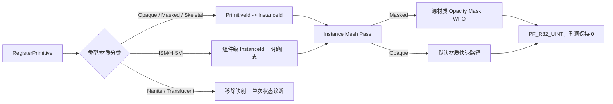
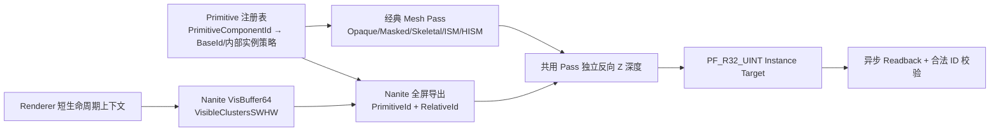

# SensorSimulation 实现路线

## 当前状态

已完成：

- [x] Semantic Channel 无后处理污染的 Global Shader。
- [x] `FImageReadbackManager::Enqueue` 与非阻塞 GPU Readback。
- [x] RGB/Semantic Payload 输出并提交给 `USimulationSubsystem`。
- [x] Semantic 标签、View Rect、Gamma 与像素格式校验。
- [x] `SensorSimulationHostEditor Win64 Development` 编译验证。
- [x] Instance 32 位 Mesh Pass、R32Uint 读回/协议/Writer，以及 D3D11/D3D12 生命周期验收。
- [x] R15 Phase B 的 ISM/HISM 逐内部实例 ID 与 D3D12 Nanite VisBuffer 专用导出。

仍待完成：

- [ ] Export Worker 与 PNG/BIN/CSV Writer。
- [ ] 多个同模态传感器的完成数量追踪。
- [ ] Frame Timeout、丢帧统计与更完整的背压策略。
- [ ] 自动化 Demo Map 和运行时像素回归测试。

## R13-R14 完成记录（2026-08-02）

- 实现真正的 uint32 Instance 通道，不复用 8 位 CustomStencil。
- 增加原生 `PF_R32_UINT` 渲染、按 RowPitch 精确读回、`R32Uint/Data/Identifier` 协议校验和 `instance_u32.bin` 文件输出。
- 显式绑定捕获 View 矩阵以及 Scene/InstanceCulling 静态 Uniform，修复后处理阶段的网格绘制。
- D3D11 与 D3D12 均完成 `0x01020304` 端到端生命周期及 Writer 验收。
- R15 Phase A 已完成：Masked Instance Capture 执行源材质 Opacity Mask/WPO，而不是绘制实心代理。
- 当时 Nanite 与 Translucent 采用显式排除，ISM/HISM 采用组件级身份；这些限制已由下方 Phase B 的当前实现更新。

## R15 特殊渲染对象（Phase A，2026-08-04）

### 为什么要这样做

普通 Opaque Mesh 可以用默认材质重绘完整轮廓，但 Masked、Nanite、Translucent 和 ISM/HISM 的可见性来源不同。如果继续把它们当普通 Mesh，Masked 孔洞会被错误填满，Nanite/Translucent 会静默缺失，ISM/HISM 则容易被误解为每个内部实例都有独立 ID。因此 Renderer 必须同时解决“能精确支持的对象”和“当前不能精确支持时如何明确失败”。

### 如何做



- `FInstanceCaptureVS/PS::ShouldCompilePermutation` 为 Masked 业务材质生成所需排列。
- Masked Draw 保留源 `MaterialRenderProxy/FMaterial`，VS 保留 WPO，PS 使用 UE 官方材质覆盖率/裁剪路径执行 Opacity Mask。
- Opaque Draw 继续使用默认材质，避免无意义的业务材质排列膨胀。
- Registry 在游戏线程注册时识别 Nanite、Translucent 与 ISM/HISM，并缓存诊断状态，热更新不会重复刷同一条日志。
- SkeletalMesh 沿动态 Mesh 可见集进入现有 Pass；普通非 Nanite SkeletalMesh 使用组件级对象 ID。

### 当前支持矩阵

| 对象 | Instance 行为 | 当前结论 |
|---|---|---|
| Opaque StaticMesh | 默认材质重绘 | 支持 |
| Masked StaticMesh/foliage | 源材质裁剪并保留 WPO | 支持（经典非 Nanite 路径） |
| SkeletalMesh | 动态 Mesh 路径、组件级 ID | 支持（非 Nanite） |
| ISM/HISM | 全部内部实例共享组件 ID | 显式支持组件级语义 |
| Nanite | 不进入经典 Mesh Pass | 显式拒绝 |
| Translucent | 尚无唯一前景标签规则 | 显式拒绝，保持背景 |

### 下一步可以怎么优化

- Phase B 为 ISM/HISM 增加 per-instance GPU 数据源，使每个内部实例写独立 uint32 ID。
- 为 Nanite 增加专用可编程 Raster/Material Export 路径，不能用经典 MeshBatch 假装支持。
- 先确定 Translucent 的产品规则（忽略、最前表面、Opacity 阈值或多层标签），再实现对应渲染路径。
- 增加 Masked foliage、SkeletalMesh 动画、Nanite 拒绝、Translucent 拒绝和 ISM/HISM 组件级行为的 D3D11/D3D12 像素回归。

## R15 阶段 B 实施审计（2026-08-07，部分完成：ISM/HISM 与 Nanite 已闭环）

### 为什么要这样做

汽车和机器人场景会大量使用 ISM/HISM、Nanite 车身或环境资产以及玻璃等半透明材质。若这些对象只写组件级 ID、静默缺失或采用未定义的透明规则，遮挡关系、实例级跟踪和训练标签都会失真。因此 R15 必须以“像素结果可证明正确”为完成标准，不能只以 Shader 能编译为准。

### 当前如何做



- [x] 语义注册表为 Actor 本体及其 ISM/HISM 内部实例预留连续的 32 位 ID 区间，并把全部合法值交给 Payload 校验。
- [x] Instance 注册绑定已携带连续区间起点、是否使用内部实例编号及实例数量；Shader 已能计算 BaseInstanceId + RelativeId。
- [x] 半透明产品策略确定为“忽略透明表面”：半透明自身不写 Instance，也不占用本 Pass 深度；其后的最近受支持不透明表面可以写入标签。玻璃材质本身若需要类别/实例标签，应另设不透明代理几何体。
- [x] 半透明对象继续显式诊断；Nanite 不再进入经典 MeshBatch，而是由专用 VisBuffer 导出路径处理。
- [x] UE 5.7.2 Renderer 在 `AddPostProcessingPasses` 调用栈内提供短生命周期扩展上下文，插件可借用当前 `FInstanceCullingManager`，但不得跨帧缓存指针。
- [x] Instance Pass 已由 Dummy Uniform 的 `AddDrawDynamicMeshPass` 改为 `AddSimpleMeshPass`，复用正式 GPU Scene 实例裁剪和 Primitive-ID 流。
- [x] Shader 同时覆盖 `USE_INSTANCING` 与 `USE_INSTANCE_CULLING`；ISM/HISM 的每个内部实例写 `BaseInstanceId + RelativeId`，两个实例的强制像素断言已在 D3D11/D3D12 通过。
- [x] Nanite 专用路径在 `NaniteRasterResults` 存活期读取 `VisBuffer64` 与 `VisibleClustersSWHW`，由 GPU Scene `PrimitiveId/RelativeId` 映射稳定 32 位 InstanceId，并与经典 Mesh Pass 共用独立反向 Z 深度。
- [x] 自包含 D3D12 回归在测试中把 Engine Cube 临时构建为 Nanite；回读同时强制断言 Nanite ID 与两个 ISM 内部实例 ID。
- [ ] Masked foliage、SkeletalMesh、独立 HISM 与半透明遮挡的完整特殊对象矩阵尚未全部完成，因此整个 R15 仍保持“部分完成”。

### 验证证据

- UE 5.7.2 `SensorSimulationHostEditor Win64 Development`：31/31 Renderer/插件增量动作通过；断言升级后 4/4 测试模块增量动作通过。
- D3D12：`Saved/Acceptance/R15_SpecialObjects/UE572_OfficialRenderer/D3D12_ISM_RequiredAssertion.log`，观察到 `16909061:20` 与 `16909062:19`，用例成功。
- D3D11：`Saved/Acceptance/R15_SpecialObjects/UE572_OfficialRenderer/D3D11_ISM_RequiredAssertion.log`，观察到 `16909061:20` 与 `16909062:20`，用例成功。
- D3D12 Nanite：`Saved/Logs/R15_NanitePixelDiscardFix_DX12.log`，观察到 Nanite `16909312:20`、ISM `16909061:20` 和 `16909062:20`，用例成功。
- Nanite Shader 的每条 `discard` 路径会先初始化颜色与深度输出，与 UE 官方 HitProxy 导出契约一致；失败探针证明省略该初始化会使整数目标回读为全背景。
- 失败探针 `D3D12_ISM_FormalCulling_Run2.log` 证明只接入正式裁剪仍不足；随后补齐 `USE_INSTANCE_CULLING` Shader 分支，形成可复现的根因—修复—回归证据链。

### 下一步怎么做

1. [x] 已在 Renderer 后处理调用栈增加最小只读上下文，并用正式 `FInstanceCullingManager` 闭环 ISM/HISM 逐内部实例 ID。
2. [x] 已在 `NaniteRasterResults` 存活期增加只读导出 Pass，解码 VisBuffer 并映射稳定 InstanceId；D3D12 真实像素断言通过。
3. 补齐独立 HISM、Masked foliage、SkeletalMesh 和半透明遮挡用例，形成 D3D11（经典路径）与 D3D12（经典 + Nanite）特殊对象像素矩阵，再把整个 R15 标记为完成。
4. 将引擎改动维护为可重复应用的补丁，并增加“官方 UE 版本变化后接口仍存在”的编译守卫，降低后续升级成本。

## Render Pipeline Owner

### 1. [x] 为 Semantic Channel 创建无后处理污染的 Global Shader

#### 为什么要这样做

Semantic 图像保存的是离散类别编号，而不是用于显示的颜色。TAA/FXAA、Bloom、Motion Blur、曝光和 Tonemap 都可能混合相邻像素或改变数值，使一个合法标签变成不存在的中间值。因此 Semantic Channel 必须绕开颜色后处理，并逐像素输出确定的整数标签。

#### 如何做

1. `USemanticObjectComponent` 把 `SemanticId` 限制到 Custom Stencil 可表达的 `0..255`；`0` 保留为背景。
2. Semantic Scene Capture 使用线性 `RGBA8` Render Target，并关闭 Anti-Aliasing、Bloom、Depth of Field、Eye Adaptation 和 Motion Blur。
3. `FSemanticCaptureViewExtension` 只接管 Semantic 专用 Scene Capture。
4. `FSemanticCapturePS` 使用整数像素坐标读取 Custom Stencil，不读取 Scene Color，不做双线性采样。
5. Shader 输出协议固定为 `R=SemanticId, G=0, B=0, A=255`，并覆盖 Tonemap 后的颜色结果。
6. 工程使用 `r.CustomDepth=3`，即 Custom Depth with Stencil。

对应代码：

- `Shaders/Private/SemanticCapture.usf`
- `SimulationRenderer/Private/SemanticCaptureViewExtension.*`
- `SimulationRenderer/Private/SimulationRenderer.cpp`
- `SimulationRenderer/Private/CameraRigComponent.cpp`
- `SimulationRuntime/Private/SemanticObjectComponent.cpp`

#### 下一步可以怎么优化

- 用真正的整数 Render Target 扩展 Instance Channel，避免 32 位实例编号被 RGBA8 限制。
- 增加离屏自动化测试，逐像素比较预期标签，并覆盖物体运动、遮挡和边缘情况。
- 用显式的捕获标识替代对 Scene Capture Source 的约定，让 Semantic View 的识别更清晰。

> 本项本轮只补充文档，没有修改已经完成的 Global Shader 代码。

### 2. [x] 实现 `FImageReadbackManager::Enqueue`

#### 为什么要这样做

每帧调用 `ReadPixels()` 会让游戏线程等待渲染线程和 GPU，破坏实时性。异步 GPU Readback 先把纹理复制到 staging texture，再通过 fence 判断 GPU 是否完成，CPU 只在就绪后复制数据，因此不会在正常轮询路径中主动等待 GPU。

#### 如何做

1. 游戏线程先验证 Render Target、Payload 类型、尺寸、Gamma 和像素格式。
2. 使用原子计数预留有限队列容量；队列满时拒绝请求并记录日志，防止内存无上限增长。
3. 通过 `ENQUEUE_RENDER_COMMAND` 在渲染线程创建 `FRHIGPUTextureReadback`。
4. 对 `[0, 0, Width, Height]` 完整 View Rect 调用 `EnqueueCopy`。
5. `PollCompleted` 只排队一次非阻塞 fence 检查；`IsReady()` 为真后才执行 `Lock`。
6. 依据返回的 `RowPitchInPixels` 逐行复制，忽略 staging texture 的行尾 padding。
7. 若底层格式为 `PF_B8G8R8A8`，复制时交换 R/B，最终 `FImagePayload::Bytes` 始终使用紧密排列的规范 RGBA8。
8. CPU Payload 拥有自己的 `TArray<uint8>`，解锁 staging texture 后数据仍然有效。
9. 共享状态使用线程安全引用计数，保证排队的渲染命令不会访问已经销毁的 Manager。

对应代码：

- `SimulationRenderer/Public/ImageReadbackManager.h`
- `SimulationRenderer/Private/ImageReadbackManager.cpp`

#### 下一步可以怎么优化

- 用统一的渲染线程 ticker 或单一 pump 命令代替每次游戏线程轮询都排队一个 pump。
- 建立 `FRHIGPUTextureReadback` 对象池，减少高频采集中的 staging 资源创建。
- 增加按通道统计的队列深度、GPU 延迟、拒绝次数和读回失败次数。
- 为 Depth、Instance 增加独立的格式转换器，而不是把 Manager 限定在 RGBA8。

### 3. [x] 输出 RGB/Semantic Payload 并提交给 Subsystem

#### 为什么要这样做

Renderer 模块只应负责捕获和读回，不能反向依赖 Runtime Subsystem，否则会形成 `SimulationRuntime -> SimulationRenderer -> SimulationRuntime` 的循环依赖。需要一个位于 Runtime 模块的 Adapter，把渲染结果交给帧聚合逻辑。

#### 如何做

1. `UCameraRigComponent::SubmitCapture` 根据请求中的模态位，只处理启用的 RGB/Semantic 通道。
2. 每个通道先调用 `CaptureScene()`，再排队 `EnqueueCopy`；渲染命令顺序保证读到本次捕获结果，而不是上一帧。
3. Camera Rig 暴露 `PollCompletedImage` 和 `GetEnabledPayloadTypes`，但不引用 Runtime。
4. 新增 `USimCameraSensorComponent` 作为 Runtime Adapter：
   - 自动查找同一 Actor 上的 `UCameraRigComponent`；
   - 把 Subsystem 的 `FCaptureRequest` 转发给 Camera Rig；
   - 每 Tick 非阻塞清空完成队列；
   - 使用移动语义调用 `USimulationSubsystem::SubmitImage`。
5. `USimSensorComponentBase::GetPayloadTypes` 让 Camera 返回 RGB/Semantic、LiDAR 返回 LiDAR。
6. Subsystem 用真实传感器能力计算整帧 `ExpectedPayloads`，不再把所有传感器都误判为 LiDAR。

运行时使用要求：

- Camera Actor 上同时添加 `UCameraRigComponent` 与 `USimCameraSensorComponent`。
- Camera Rig 的 Channels 中启用 RGB 和/或 Semantic。
- Adapter 默认自动关联同一 Actor 上的 Camera Rig，也可以在 Details 中显式指定。
- 只有通过 Runtime Adapter 发起的捕获才会进入同步 Frame/Subsystem 管线；编辑器调试按钮仍是独立人工检查入口。

对应代码：

- `SimulationRenderer/Public/CameraRigComponent.h`
- `SimulationRenderer/Private/CameraRigComponent.cpp`
- `SimulationRuntime/Public/SimCameraSensorComponent.h`
- `SimulationRuntime/Private/SimCameraSensorComponent.cpp`
- `SimulationRuntime/Public/SimSensorComponentBase.h`
- `SimulationRuntime/Public/SimLidarSensorComponent.h`
- `SimulationRuntime/Private/SimulationSubsystem.cpp`

#### 下一步可以怎么优化

- [x] FrameAssembler 已按稳定 `SensorGuid + ChannelGuid` 记录逐图像通道完成状态；同名传感器以及同一传感器的同模态多配置互不覆盖。
- Adapter 可增加采样频率调度，避免所有相机完全依赖 Subsystem 的全局固定步长。
- [x] `RequestCapture` 已返回 `Accepted/Busy/Rejected`；队列 Busy 或资源 Rejected 会立即反馈给 FrameAssembler 并终止帧。
- [x] 完成 Payload 已送入有界 Export Worker 队列，文件编码不占用游戏线程。
- 下一步可增加 Pending Frame 容量上限，并将终态历史容量与拒绝策略参数化。

### 3.1 [x] 图像通道寻址升级为 ChannelGuid

#### 为什么要这样做

`ChannelType` 只能说明图像是 RGB、Semantic、Depth 或 Instance，不能唯一表示某条配置。若同一类型出现两次，按类型查询会拿到第一张 RenderTarget，按模态完成计数会提前结束帧，文件也可能覆盖。

#### 如何做

- `FCaptureRequest::ExpectedImageChannels` 显式携带每条 `ChannelGuid + PayloadType`。
- Camera Rig 允许同一 `ChannelType` 多配置，资源创建、热更新复用、RenderTarget 和像素格式查询以 ChannelGuid 寻址。
- Readback 把 ChannelGuid 固化到任务键和 `FImagePayload`；指标按 `SensorGuid + ChannelGuid` 隔离。
- FrameAssembler 分别等待每个 ChannelGuid，并按 ChannelGuid 判断重复 Payload。
- 图像 Writer 始终使用完整 ChannelGuid 后缀，frame/session metadata 同步写出该身份。

#### 下一步可以怎么优化

- 为 Blueprint 调试入口增加可选择 ChannelGuid 的下拉或详情面板；当前按模态的保存按钮默认选择第一条对应通道。
- 把无效/重复 ChannelGuid 从日志校验提升为配置资产的数据验证规则。

### 4. [x] 验证标签合法值、View Rect、Gamma 和像素格式

#### 为什么要这样做

即使 Shader 正确，错误的纹理格式、Gamma、View Rect 或 CPU 通道顺序仍会悄悄破坏标签。如果等到导出后才发现，错误会扩散到整批数据集。因此校验分布在“GPU Copy 前”和“进入 FrameAssembler 前”两个边界。

#### 如何做

##### 标签合法值

- `FSemanticRegistry::GetImageSemanticIds` 收集背景 `0` 和当前有效 Semantic Component 的 8 位标签。
- Subsystem 对 Semantic Payload 逐像素检查：
  - R 必须属于合法标签集合；
  - G 必须为 0；
  - B 必须为 0；
  - A 必须为 255。
- 任一像素非法时，整个 Payload 被拒绝，不进入 FrameAssembler，并输出包含 Frame、Sensor、类型和尺寸的错误日志。

##### View Rect

- 提交时要求 Render Target 的宽高大于 0。
- 渲染线程再次确认 RHI Texture 的尺寸与提交时尺寸完全一致。
- GPU Copy 显式使用完整 `FResolveRect(0, 0, Width, Height)`。
- CPU 复制检查 `RowPitch >= Width`、`BufferHeight >= Height`，并逐行复制有效宽度。
- Payload 必须满足 `Bytes.Num() == Width * Height * 4`。

##### Gamma

- Semantic Render Target 必须设置 `bForceLinearGamma=true`，否则 Enqueue 直接拒绝。
- RGB 保留 Channel 配置，可按显示图像需求使用非线性输出。
- Semantic 值不经过 sRGB/Gamma 转换，R 字节才能精确恢复原始 ID。

##### 像素格式

- 当前正式图像管线只接受 `PF_B8G8R8A8` 或 `PF_R8G8B8A8`。
- 两种 RHI 布局都会被规范化成协议统一的紧密 RGBA8。
- Payload 固定 `BytesPerPixel=4`；尺寸或字节数不匹配会被 Subsystem 拒绝。

对应代码：

- `SimulationRenderer/Private/ImageReadbackManager.cpp`
- `SimulationRuntime/Public/SemanticRegistry.h`
- `SimulationRuntime/Private/SemanticRegistry.cpp`
- `SimulationRuntime/Public/SimulationSubsystem.h`
- `SimulationRuntime/Private/SimulationSubsystem.cpp`

#### 下一步可以怎么优化

- 当前 Semantic 校验是每帧全像素扫描，适合正确性优先阶段；后续可用 SIMD、并行任务或 GPU reduction 统计非法标签。
- 在 Payload 中显式记录 `PixelFormat`、`ColorSpace`、`ViewRect` 和 `RowStride`，减少仅靠管线约定解释数据的风险。
- 将第一个非法像素的坐标、实际 RGBA 和期望集合写入诊断日志，提升定位效率。
- 增加开发环境严格模式与发布环境采样校验模式，平衡性能和数据质量。

## 验证方法

### 编译验证

已执行：

```text
E:\unreal\Windows\Engine\Build\BatchFiles\Build.bat SensorSimulationHostEditor Win64 Development -Project=D:\ueprojects\SensorSimulationHost\SensorSimulationHost.uproject -WaitMutex -NoHotReloadFromIDE
```

结果：`Succeeded`。

### 编辑器运行时验证

1. 创建 Camera Actor，添加 `UCameraRigComponent` 和 `USimCameraSensorComponent`。
2. 在 Camera Rig 的 Channels 中启用 RGB 与 Semantic；Semantic 必须为线性 Gamma。
3. 创建三个带可渲染 Primitive 的 Actor，分别添加 `USemanticObjectComponent`，设置 `SemanticId=10/20/200`。
4. 确认 `r.CustomDepth=3`，修改配置后重启编辑器。
5. 进入 PIE，让 `USimulationSubsystem` 按固定步长发起请求。
6. Output Log 中不应出现：
   - `Readback rejected`
   - `Readback View Rect validation failed`
   - `GPU readback returned an invalid buffer`
   - `Rejected image payload`
7. 人工检查 Semantic Render Target：
   - 背景为 0；
   - 对象 R 通道分别为 10、20、200；
   - G/B 为 0，A 为 255；
   - 物体内部均匀；
   - 边缘无渐变、泛光和拖影；
   - 相机或物体移动后没有旧标签残影。

> `Save Semantic Debug Image` 使用同步 PNG 导出，仅用于人工调试。正式逐帧管线使用本次实现的 `FRHIGPUTextureReadback`，不会复用同步 `ReadPixels` 路径。

## 首个集成验收

- 场景中一个 Camera Rig + Camera Adapter 和一个 16×512 LiDAR。
- 三个带 Semantic Component 的可渲染 Actor。
- 同一 Frame 输出 RGB、Semantic、LiDAR 和 Ground Truth。
- LiDAR `ExpectedRayCount == CompletedRayCount`。
- Semantic 图像非法 ID 像素数为 0。
- 正式逐帧管线不调用同步 `ReadPixels()`。
